**Thanks for purchasing keyestudio products, we will endeavor to provide you with satisfying products and services!**

------

**About** **Keyestudio**                       

Keyestudio is a best-selling brand owned by KEYES Corporation. Our product contains Arduino development boards, expansion boards, sensors and modules, Raspberry Pi, micro: bit expansion boards as well as smart cars, which can help customers at any level to learn about Arduino.

Notably, all of our products are in line with international quality standards and are greatly appreciated in a broad menu of different markets across the world.

Welcome to check out more contents from our official website:

http://www.keyestudio.com

------


**Obtain Information and After-sales Service**          

1. Download address: 
2. If something is found missing or broken, or you have some difficulty learning the kit, please feel free to contact us. Welcome to send email to us: [service@keyestudio.com](http://m.138.gz.cn/webadmin/~CAmsnCrrNXhTAySKCerrIfWjjZuuWVfI/~/usr/mod_edituser.jsp?;uid=service@keyestudio.com;;clearCache=)
3. We will endeavor to update projects and products continuously from your sincere advice! Thanks!

------


**Warning**                            

1. This product contains tiny parts (Screws, copper pillars), so please keep out of reach of children under 7. 
2. This product contains conductive parts (control board and electronic module). Please operate according to the requirements of tutorials. Improper operation may damage parts due to overheating. Do not touch and immediately disconnect the circuit power.

------


**Copyright**                           

The keyestudio trademark and logo are the copyright of KEYES DIY ROBOT co.,LTD. All products under Keyestudio brand can’t be copied, sold or resold without authorization by anyone or company.

If you are interested in our products, please contact to our sales representatives: 

[fennie@keyestudio.com](http://m.138.gz.cn/webadmin/~CAmsnCrrNXhTAySKCerrIfWjjZuuWVfI/~/usr/mod_edituser.jsp?;uid=fennie@keyestudio.com;;clearCache=)

------

# **Motion Sensing GloveGesture Control Smart Car for Arduino** 

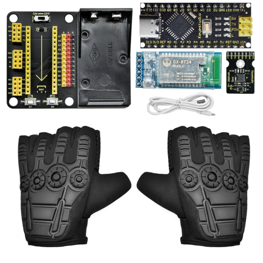 

 

------

- [**Motion Sensing GloveGesture Control Smart Car for Arduino**](#motion-sensing-glovegesture-control-smart-car-for-arduino)
  - [**Introduction**](#introduction)
  - [**Features**](#features)
  - [**Parameters**](#parameters)
  - [**Kit List**](#kit-list)
  - [**Projects**](#projects)
    - [**Install Development Software and Driver**](#install-development-software-and-driver)
      - [**Install Arduino IDE**](#install-arduino-ide)
      - [**NANO PLUS Development Board**](#nano-plus-development-board)
      - [**Install Development Board Driver**](#install-development-board-driver)
      - [**Arduino IDE Settings and Toolbar**](#arduino-ide-settings-and-toolbar)
      - [**Start Your Program**](#start-your-program)
    - [**Install Library Files**](#install-library-files)
      - [**What is an Arduino Library File?**](#what-is-an-arduino-library-file)
      - [How to Install a Library File?](#how-to-install-a-library-file)
    - [**Glove Expansion Board**](#glove-expansion-board)
    - [**MPU6050 Basic Information**](#mpu6050-basic-information)
      - [**MPU6050**](#mpu6050)
      - [**Gyroscope**](#gyroscope)
      - [**Accelerometer**](#accelerometer)
      - [**Acquire Data**](#acquire-data)
      - [**Wiring**](#wiring)
      - [**Data Acquiring Process**](#data-acquiring-process)
        - [**Acquire Sensor ID**](#acquire-sensor-id)
        - [**Set Data Scales**](#set-data-scales)
        - [**Self-Test**](#self-test)
        - [**Calibration**](#calibration)
        - [**Initialization**](#initialization)
        - [**Data Preparation**](#data-preparation)
        - [**Read Sensor Data**](#read-sensor-data)
      - [**Test Results**](#test-results)
      - [**Test Code**](#test-code)
      - [**Expansion Code**](#expansion-code)
    - [**MPU6050 Attitude**](#mpu6050-attitude)
      - [**Attitude**](#attitude)
      - [**Acquire Attitude**](#acquire-attitude)
      - [**Wiring**](#wiring-1)
      - [**Attitude Acquiring Process**](#attitude-acquiring-process)
        - [**Convert Accelerometer Data**](#convert-accelerometer-data)
        - [**Convert Gyroscope Data**](#convert-gyroscope-data)
        - [**Calculate Integration Interval**](#calculate-integration-interval)
        - [**Convert 6-Axis Data to Quaternion**](#convert-6-axis-data-to-quaternion)
        - [**Quaternion Conversion Function**](#quaternion-conversion-function)
        - [**Convert Quaternion to Euler Angle**](#convert-quaternion-to-euler-angle)
      - [**Test Result**](#test-result)
      - [**Test Code:**](#test-code-1)
    - [**BT Receiving and Sending**](#bt-receiving-and-sending)
      - [**Bluetooth Module**](#bluetooth-module)
      - [**AT** **Commands**](#at-commands)
      - [**Wiring**](#wiring-2)
      - [**Control BT by** **AT** **Commands**](#control-bt-by-at-commands)
        - [**Operate Host Devices**](#operate-host-devices)
        - [**Operate Slave Devices**](#operate-slave-devices)
      - [**AT Command Collection**](#at-command-collection)
      - [**Connect Host to Slave Devices**](#connect-host-to-slave-devices)
      - [**Communication of Host and Slave Device**](#communication-of-host-and-slave-device)
    - [**Operate Mecanum Cars**](#operate-mecanum-cars)
      - [**Angles of the Glove**](#angles-of-the-glove)
      - [**Gesture Angle Code**](#gesture-angle-code)
      - [**Car Operation Code**](#car-operation-code)
  - [**Reference Links**](#reference-links)
  - [**Attachment: Installation Steps**](#attachment-installation-steps)


------


## **Introduction**

Based on MPU6050, this motion sensing glove is capable to recognize several directions of gestures. Compared with traditional operation mode like buttons or sliding, gestures allow you to control your devices at will.

This glove connects with Mecanum cars, robot arms and biped robots via BT24 Bluetooth, so that you can manipulate various movements (the advance of small cars, gripper of robot arms, and walking of robots) only by simple gestures.  

Besides, it is easy to install. You just need to splice several modules together. And extra modules can be connected to the expansion board for easier control. 

To bring you a better experience on intelligence and convenience of gesture control, multiple Arduino C language projects are prepared for you. In these projects, we will start from lighting up an LED to gesture control to ensure that you get started easily to master this skill. 

------


## **Features**

1. Powerful function: It is able to recognize different directions.
2. Simple installation: You need to splice several modules together without welding circuit.
3. Strong extensibility: It can attach additional sensors on the expansion board with commonly used interfaces.
4. Basic programming learning: couple with C language of Arduino IDE.

------


## **Parameters**

Working voltage: 5V

Battery voltage: 9V

Maximum current output: ≤20mA (9V battery)

Maximum power dissipation: ≤0.18W

BT communication distance: 40M (in open space)

BT working frequency: 2.4GHz ISM frequency band

Working temperature: –10°C ~ +65°C

------


## **Kit List**

When you receive this product, please check according to Attachment: Kit List to ensure that all components are intact.

If something is found missing, please contact us immediately.

| **NO.** |         **PIC**         |        **Specification**         | **QNT** |
| :-----: | :---------------------: | :------------------------------: | :-----: |
|    1    | 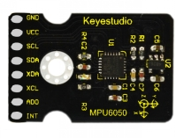 |          MPU6050 Module          |    1    |
|    2    | 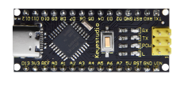 |   NANO PLUS Development Board    |    1    |
|    3    | 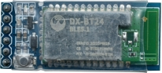 |         DX-BT24 V5.1 BLE         |    1    |
|    4    | 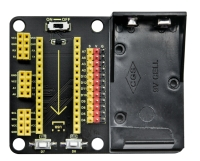 |       NANO Expansion Board       |    1    |
|    5    |  | FY672 Half-Finger Gloves(M size) |    1    |
|    6    | 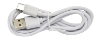  |            USB Cable             |    1    |

 For complete installation, please refer to "[Attachment: Installation Steps](#Attachment: Installation Steps)".

------


## **Projects**

Note: G and GND on the expansion board are negative poles to connect with G, GND and - on sensors, while V and VCC are positive poles to connect with 5V power interfaces like V, VCC and +.

------


### **Install Development Software and Driver**

#### **Install Arduino IDE**

Download the latest version of Arduino IDE: https://www.arduino.cc/. 

Click SOFTWARE on the upward side of the page: 

 

Select a compatible version. 

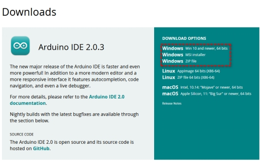 

Two versions are included in Windows system: for installing and for downloading(a zipped file, directly unzip it to use without installing).

 

Click JUST DOWNLOAD. 

 

------


#### **NANO PLUS Development Board**

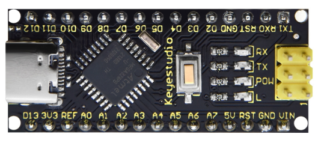 

The processor core and USB-to-serial port chip of this board respectively adopt ATMEGA328P-AU and CH340G. Compared with ARDUINO NANO, their using methods are exactly the same except driver installation. 

It is comprised of 14 channel digital I/O interfaces (six of them are used as PWM outputs), 8 channel analog input interfaces, a 16MHz crystal oscillator, a Type-C USB port, ICSP headers and a RESET button. 

ICSP headers are used for burning firmwares on ATMEGA328P-AU. When using, we power it via Type-C USB or VIN GND (DC 7-12V) pin. 

 

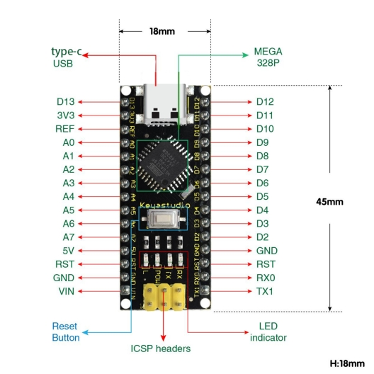 

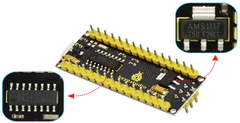 

 

It supports MCU, and connects pin Vin and GND (DC 7-12V) ports by a USB power supply to operate. 

 

Interface descriptions: 

| NO.  |       Port Name        |                         Description                          |
| :--: | :--------------------: | :----------------------------------------------------------: |
|  1   |      ICSP Headers      | They consist of MOSI, MISO, SCK, RESET, VCC and GND, commonly called SPI (Serial Peripheral Interface). They burn firmwares on ATMEGA328P-AU if connecting with computer. |
|  2   |  LED indicator（RX）   | It is used for serial communication. RX indicator will blink if the board receives messages. |
|  3   |  LED indicator（TX）   | It is used for serial communication. TX indicator will blink if the board sends messages. |
|  4   |  LED indicator（POW）  | LED will light up if the control board starts to work. Otherwise, the indicator goes off. |
|  5   |   LED indicator（L）   | When D13 pin is at a high level, LED lights up. On the contrary, it goes off. |
|  6   | RX0(D0)TX1(D1)D2 - D13 | 14 digital I/O pins (D0-D13) are included, six of which are used as PWM outputs. These are digital input pins for logic values (0 or 1). |
|  7   |          RST           |     It externally connects buttons used as Reset Button.     |
|  8   |     ATMEGA328P-AU      | This MCU is seen as the brain of the board. For more details, please refer to the data sheet. |
|  9   |        MINI USB        | It powers the control board and uploads programs when connecting to computer. |
|  10  |          3V3           |            It provides an output voltage of 3.3V.            |
|  11  |          REF           | This analog pin sets the external reference voltage (0V to 5V) as the limit of analog input. |
|  12  |         A0-A7          |                 A0-A7 are eight analog pins.                 |
|  13  |           5V           |                 It is an 5V voltage I/O pin.                 |
|  14  |          GND           | It is the negative pole of power supply and  connects with ground. |
|  15  |          VIN           | It powers the board via an external input voltage of DC 7-12V. |
|  16  |      Reset Button      |       This button is able to reset the control board.        |
|  17  |         CH340G         | It is a USB-to-serial port chip to convert computer USB signal to serial signal. |
|  18  |        AMS1117         | It powers the mainboard by converting the voltage of external input DC 7-12V to DC 5V. |

------


####  **Install Development Board Driver**

Connect the control board to computer via USB cable. 

If your computer is Windows10 System, it will install the driver automatically. If it is Windows7 System, you need to operate manually. 

The USB-to-serial port chip of the board adopts CH340G, and you need to install the chip driver whose file is usb_ch341_3.1.2009.06. 

If it is the first time for the control board to connect to computer, please click Computer -- Properties -- Device Manager: 

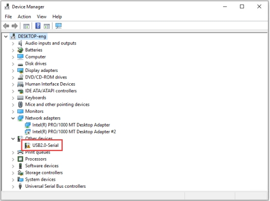 

Click USB Serial to select“Update Driver”.

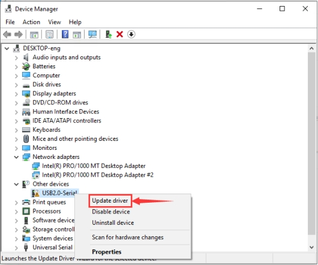 

Select“browse my computer for drivers”.

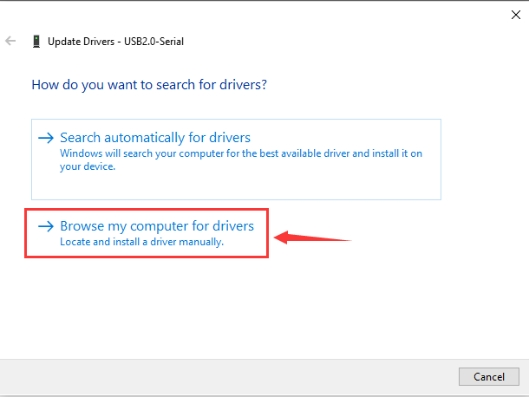 

 

Find the folder usb_ch341_3.1.2009.06 in your computer. 

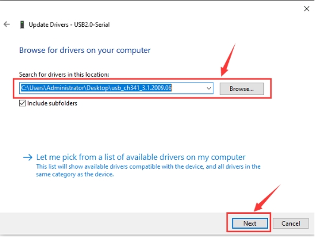 

After installation, the following window pop up. 

Click Close to select the serial port.

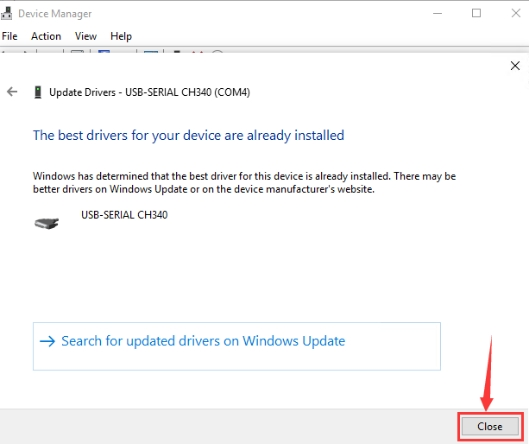 

Click Computer--Properties--Device Manager to select PORT: 

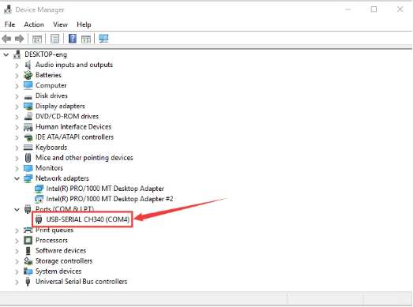 

------


####  **Arduino IDE Settings and Toolbar**

Open Arduino IDE. 

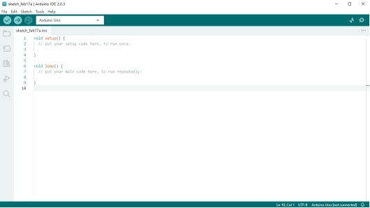 

Click Tools to select Arduino NANO Board.

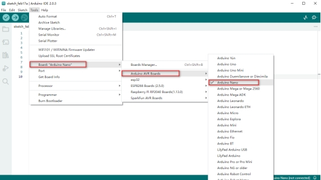 

Select the correct COM Port. 

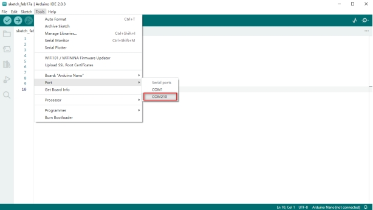 

------


####  **Start Your Program**

Click File to select Blink in 01.BASIC in the Example code.

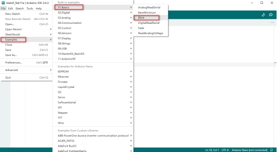 

Set the board and COM port, and click“√”or“→”to compile/examine and upload the code. 

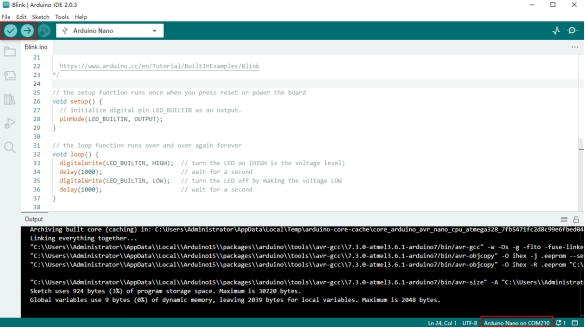 

The code is successfully uploaded: 

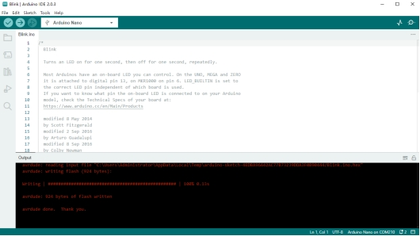 

The on-board LED will turn on for 1s and off for 1s. 

For more details, please refer to: https://www.arduino.cc/reference/en/

------


### **Install Library Files**

####  **What is an Arduino Library File?**

A library is a code collection for easy uploading programs to sensors, displays and modules.

Internet carries hundreds of libraries for download. We have listed built-in libraries and manually-added libraries in reference. 

------


####  How to Install a Library File?

Click Skerch > Include Library > Add .Zip Library... 

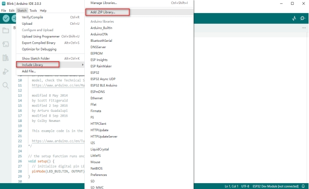 

Select and click the library file(zip. format) you need to add as library. 

The massage bar will display“Library installed”if the file is successfully upload.

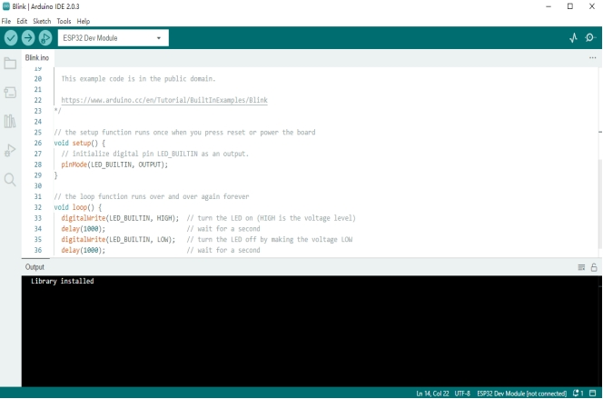 

For more details, please visit our official website: 

https://www.keyestudio.com/

------


###  **Glove Expansion Board**

This motion sensing glove expansion board can power independently due to its 9V battery holder. 

It is equipped with UART and I2C communication interfaces as well as two buttons (D7 and D8), and it is able to connect to external sensors. 

What’s more, you only need to assemble MPU6050 module and BT24 on the board to complete the installation.

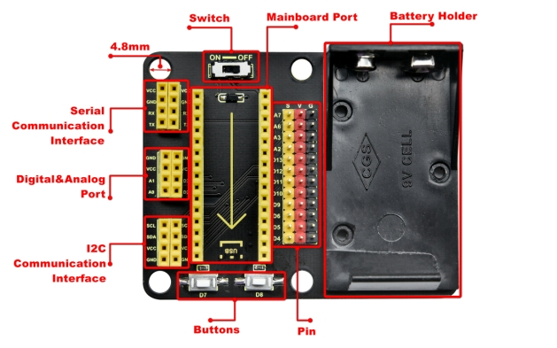 

 

Working principle diagram: 

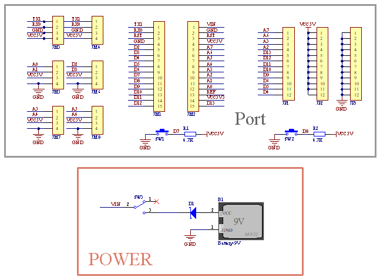 

------


###  **MPU6050 Basic Information**

####  **MPU6050**

MPU6050 is a 6-axis motion processor(one 3-axis gyroscope and one 3-axis accelerometer). The two sensors are integrated on one chip which can detect static and dynamic motion states, including angular velocity, angle and acceleration. 

------

This module is equipped with a 16-pin ADC, which simultaneously reads 6-axis data. Thus, the angular speed, angular angle and the acceleration of the object can be measured. 

It also contains a temperature sensor to detect and monitor the temperature of the chip when operating. 

------

Furthermore, it incorporates an DMP (Digital Motion Processor) to acquire the state of object from original data of gyroscope and accelerometer.

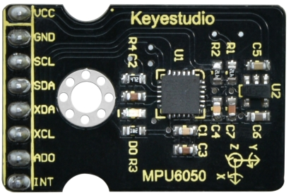 

Circuit diagram: 

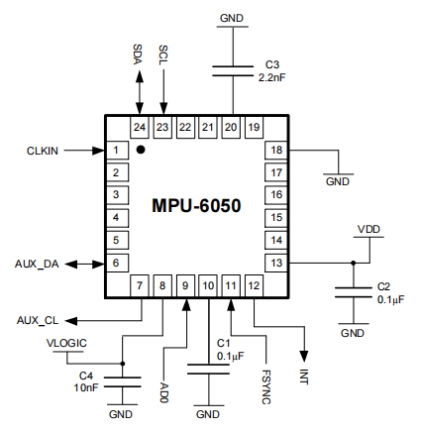 

 

| **NO.** | **Name** |                       **Description**                        |
| :-----: | :------: | :----------------------------------------------------------: |
|    1    |   GND    |                 Negative pole interface (0V)                 |
|    2    |   VCC    |    Positive pole interface (compatible with 3.3V and 5V)     |
|    3    |   SDA    |     I2C Data Line. It connects to MCU to transmit data.      |
|    4    |   SCL    | I2C Clock Line. It connects to MCU to synchronize data transmission. |
|    5    |   XDA    | I2C Data Line. It connects to external sensors to transmit data. |
|    6    |   XCL    | I2C Clock Line. It connects to external sensors to synchronize data transmission. |
|    7    |   AD0    | I2C sub-address. The address is 0x69 when the board is at a high level, while the address is 0x68 when at low. |
|    8    |   INT    | An external interrupt pin. It detects MPU6050 internal interrupt time. |

 

l Operating voltage: 3.3V, 5V

l Static current: 5μA

l Rotating current: 3mA

l Maximum rotation speed: 2000°/s

l Acceleration scales: ±2g, ±4g, ±8g, ±16g

l Temperature range: –10°C ~ +65°C

***\*For detailed parameters, please refer to the data sheet.\****

------


####  **Gyroscope**

A gyroscope, also called rotating angular ratemeter, is a device used to measure rotation speed. 

------

Generally, a gyroscope consists of a magnetoresistor (measuring the gyroscopic force), amplifying and adjusting circuits, and an output circuit. 

The gyroscope accurately measures the rotation speed to get precise information. Virtually, it is usually applied in vehicle driving direction detection, aircraft attitude angle measurement as well as precision instrument control systems.

 

 

------

 

####  **Accelerometer**

An accelerometer measures the acceleration of gravity to calculate the tilt angle of a device relative to the horizon and to deduce the movement way of the device. 

It also allows robots to know their surroundings and attitudes, and is even utilized to analyze engine vibration.

***MPU6050adopts gyroscope to measure angles and uses accelerometer to measure the acceleration.*** 

------


####  **Acquire Data**

MPU-6050 boasts I2C serial communication protocol to acquire data. 

I2C(Inter-Integrated Circuit, or IIC) is also called two-wire system or TWI (Two-Wire Interface), which is a two-wire bus communication protocol in a host-subordinate model. 

The biggest advantage of I2C is that it transmits data only by two wires. In addition, its bus connects 127 nodes in parallel for multiple host devices, and slave devices generally do not need an external power supply as the bus transfers power to them.

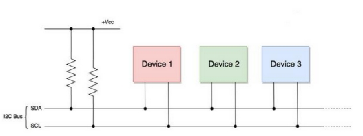 

------

Please pay attention that, the host device manipulates clock signals and data transmission, while the slave ones only receives. 

I2C bus is composed of SCL (Serial Clock takes charge of the clock signal) and SDA (Serial Data controls data transmission), and it uses an 8-digit transmission mode. Usually, a byte contains nine clock signals, eight of which transmit data and the last one indicates the end of transmission. 

------

Meanwhile, the bus supports multiple bytes transmission by repeating the previous process. 

Basic parts of I2C protocol:  

- Starting signal: Before sending data, the sender transmits a starting signal to inform the receiver to prepare for receiving. 
- Address code: It tells the receiver that to whom the data is to be sent. 
- Data: It is transmitted through one byte each time.  
- Stopping signal: The sender ends the data in a stopping signal to note the receiver to prepare for stopping receive. 

***\*Serial Port Protocol Timing:\**** 

**(For more details, please refer to :https://www.nxp.com/)**

 

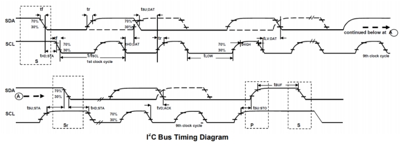 

Arduino provides an I2C protocol collection named as Wire.h, so you can call its functions to realize I2C and I2C/TWI devices communication. 

For detailed introduction, please refer to: https://www.arduino.cc/reference/en/language/functions/communication/wire/

------


####  **Wiring**

Connect Arduino NANO mainboard and MPU6050 to the expansion board.

 

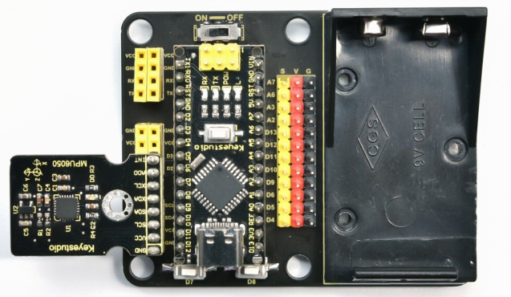 

 

Connect Arduino NANO to your computer via a USB cable and open Arduino IDE. 

------

 

####  **Data Acquiring Process**

#####  **Acquire Sensor ID**

Obtain the internal ID of MPU6050 and compare it with the counterpart in the data sheet (0x68).

 

***\*Code:\**** 

```c++
//Acquire the ID value of MPU6050 sensor

uint8_t c = mpu.readByte(MPU6050_ADDRESS, WHO_AM_I_MPU6050);
```

------


#####  **Set Data Scales**

Set the scales of gyroscope and accelerometer. Refer to the register sheet and we know: 

Resolution of Accelerometer: 

 

 

Resolution of Gyroscope: 

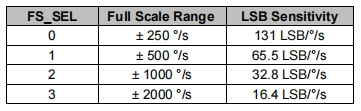 

 

***\*Code:\****

```c++
//scales are as followings:
// GFS_250DPS:250 DPS (0x00), GFS_500DPS:500 DPS (0x01)
// GFS_1000DPS:1000 DPS (0x10), GFS_2000DPS:2000 DPS (0x11)
// AFS_2G:2 Gs (0x00), AFS_4G: 4 Gs (0x01)
// AFS_8G:8 Gs (0x10), AFS_16G:16 Gs  (0x11)
//Set the scales of MPU6050 sensor.

mpu.settings(AFS_2G, GFS_250DPS); 
```

------


##### **Self-Test**

Upload the self-test code to ensure the accurate data and effective output.

 

***\*Code:\**** 

```c++
//[use in step()] MPU6050 inspects itself and stores 3-axis data of accelerometer  and gyroscope in SelfTest[6]. 

//Set the scales of acceleration to 8g and scales of gyroscope to 250dps when they are in their self-test.

// Self-test value storing container

float SelfTest[6];        

// MPU6050 conducts a self-test

mpu.MPU6050SelfTest(SelfTest); 

```

------


#####  **Calibration**

Upload the calibration code. 

Readings are impacted by temperature, humidity, vibration and external magnetic field. Thus, a calibration process guarantees the accuracy. 

 

***\*Code:\**** 

```c++
//[Use in step()] calibrate accelerometer  and gyroscope, and load biases in the bias register and store the values in gyroBias[3] and accelBias[3].

float gyroBias[3] = {0, 0, 0}; // Correct gyroscope and accelerometer  bias. 

float accelBias[3] = {0, 0, 0};


mpu.calibrateMPU6050(gyroBias, accelBias);
```

------


#####  **Initialization**

Initialize the device. 

Cut off the interrupt interface and AUX IIC interface, ban FIFO, and set the gyroscope sampling rate and the DLPF. 

This step can calibrate the sensor to make sure a normal state. 

***\*Code:\****

```c++
//[use in step()] initialize MPU6050

mpu.initMPU6050();
```

------


#####  **Data Preparation**

Check whether data are prepared for collection. 

***\*Code:\**** 

```c++
//Determine whether data are prepared

if(mpu.readByte(MPU6050_ADDRESS, INT_STATUS) & 0x01)
{
}
```

------


#####  **Read Sensor Data**

Read the value of the accelerometer, gyroscope and temperature sensor. 

 

***\*Code:\**** 

```c++
//Read the initial value of accelerometer, gyroscope and temperature senor

int16_t accelCount[3];      // Store 16-bit signed output of accelerometer

int16_t gyroCount[3];      // Store 16-bit signed output of gyroscope

int16_t tempCount;        // Store the real internal chip temperature in degrees Celsius

 

// Read the initial value of accelerometer

mpu.readAccelData(accelCount);

// Read the initial value of gyroscope

mpu.readGyroData(gyroCount);

//Read the initial value of temperature sensor

tempCount = mpu.readTempData();
```

------

 

####  **Test Results**

Place the expansion board smoothly, press and hold the reset button. The more balanced the MPU6050 is, the more accurate the data it acquired will be. 

Open Arduino IDE serial monitor, and you will see that the angular speed, gyroscope data and temperature refresh per 0.5s. 

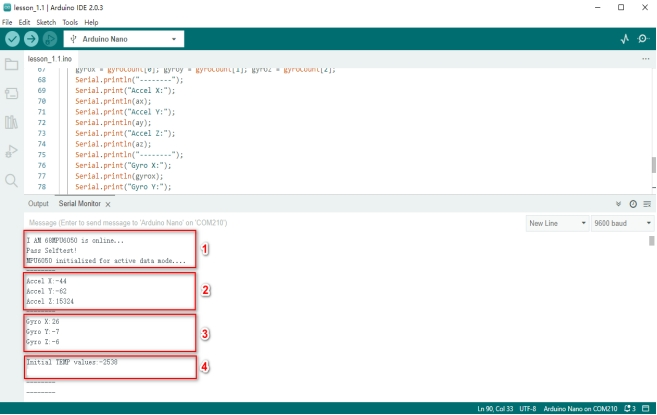 

 

1. The initialization of MPU6050 will spend about 3s. Initialize it once only. Please put the expansion board and MPU6050 smoothly in initialization.
2. Initial acceleration value of MPU6050.
3. Initial gyroscope value of MPU6050.
4. Initial temperature value of MPU6050.

------


#### **Test Code**

Please refer to the folder lesson_1_1. 

[lesson_1_1.ino]:

```c++
#include <MPU6050.h>

MPU6050lib mpu;

int16_t accelCount[3];      // Store 16-bit signed output of accelerometer 

int16_t gyroCount[3];      // Store 16-bit signed output of gyroscope

int16_t tempCount;        // Store the real internal chip temperature in degrees Celsius

float gyroBias[3] = {0, 0, 0}; // Correct gyroscope and accelerometer  bias

float accelBias[3] = {0, 0, 0};

float SelfTest[6];        // Self-test value storing container


void setup()

{

 Wire.begin();

 Serial.begin(9600);

 // Read the WHO_AM_I register, this is a good test of communication

 // Read WHO_AM_I register for MPU-6050

 uint8_t c = mpu.readByte(MPU6050_ADDRESS, WHO_AM_I_MPU6050);  

 Serial.print("I AM ");

 Serial.print(c, HEX);

 //Set the minimum scale if the device is in self-test

   // Possible gyro scales (and their register bit settings) are: 

   // 250 DPS (0x00), 500 DPS (0x01), 1000 DPS (0x10), and 2000 DPS  (0x11).

   // Possible accelerometer scales (and their register bit settings) are:

   // 2 Gs (0x00), 4 Gs (0x01), 8 Gs (0x10), and 16 Gs  (0x11).

 mpu.settings(AFS_8G, GFS_250DPS);

 // version WHO_AM_I should always be 0x68 //MPU6050 address 1: 0x68, address 2: 0x98

 if (c == 0x68 || c == 0x98) {

  Serial.println("MPU6050 is online...");

  // Start by performing self test

  mpu.MPU6050SelfTest(SelfTest);


  if (SelfTest[0] < 1.0f && SelfTest[1] < 1.0f && SelfTest[2] < 1.0f && SelfTest[3] < 1.0f && SelfTest[4] < 1.0f 

  && SelfTest[5] < 1.0f) {

   Serial.println("Pass Selftest!");

   // Calibrate gyro and accelerometers, load biases in bias registers

   mpu.calibrateMPU6050(gyroBias, accelBias);

   mpu.settings(AFS_2G, GFS_250DPS);

   mpu.initMPU6050();

   // Initialize device for active mode read of accelerometer , gyroscope, and temperature

   Serial.println("MPU6050 initialized for active data mode...."); 

  }

  else{

   Serial.print("Could not connect to MPU6050: 0x");

   Serial.println(c, HEX);

   // Loop forever if communication doesn't happen

   while (1) ; 

  }

 }

}


void loop()

{

 // If data ready bit set, all data registers have new data

 // check if data ready interrupt

 if (mpu.readByte(MPU6050_ADDRESS, INT_STATUS) & 0x01) {

  // Read the x/y/z adc values

  mpu.readAccelData(accelCount);

  // Read the x/y/z adc values

  mpu.readGyroData(gyroCount);

  Serial.println("--------");

  Serial.print("Accel X:");

  Serial.println(accelCount[0]);

  Serial.print("Accel Y:");

  Serial.println(accelCount[1]);

  Serial.print("Accel Z:");

  Serial.println(accelCount[2]);

  Serial.println("--------");

  Serial.print("Gyro X:");

  Serial.println(gyroCount[0]);

  Serial.print("Gyro Y:");

  Serial.println(gyroCount[1]);

  Serial.print("Gyro Z:");

  Serial.println(gyroCount[2]);

  Serial.println("--------");

  // Read the x/y/z adc values

  tempCount = mpu.readTempData();

  // Temperature in degrees Centigrade

  Serial.print("Initial TEMP values:");

  Serial.println(tempCount);

  Serial.println("--------");

  delay(500);

 }
```

------


####  **Expansion Code**

The initial temperature value of MPU6050 cannot be applied in our daily use, hence it needs to be converted to the usual unit. 

***\*Conversion Formula:\****

$$
Temperature in degrees C = (TEMPOUT Register Value as a signed quantity)/340 + 36.53
$$
***\*For detailed operations, please refer to the data sheet.\****

 

Please refer to the folder lesson_1_2.

[lesson_1_2.ino]:

```c++
#include <MPU6050.h>

 

MPU6050lib mpu;

 

int16_t tempCount;        // Store the real internal chip temperature in degrees Celsius

float temperature;        // Store the actual temperature in degrees Centigrade

float gyroBias[3] = {0, 0, 0}; // Correct gyroscope and accelerometer  bias

float accelBias[3] = {0, 0, 0};

float SelfTest[6];        // Self-test value storing container

 

void setup()

{

 Wire.begin();

 Serial.begin(9600);

 // Read the WHO_AM_I register, this is a good test of communication

 // Read WHO_AM_I register for MPU-6050

 uint8_t c = mpu.readByte(MPU6050_ADDRESS, WHO_AM_I_MPU6050);  

 Serial.print("I AM ");

 Serial.print(c, HEX);

 //Set the minimum scales if the device is in self-test

   // Possible gyro scales (and their register bit settings) are: 

   // 250 DPS (0x00), 500 DPS (0x01), 1000 DPS (0x10), and 2000 DPS  (0x11).

   // Possible accelerometer scales (and their register bit settings) are:

   // 2 Gs (0x00), 4 Gs (0x01), 8 Gs (0x10), and 16 Gs  (0x11).

 mpu.settings(AFS_8G, GFS_250DPS);

 // version WHO_AM_I should always be 0x68 //MPU6050 address 1: 0x68, address 2: 0x98

 if (c == 0x68 || c == 0x98) {

  Serial.println("MPU6050 is online...");

  // Start by performing self test

  mpu.MPU6050SelfTest(SelfTest);

  if (SelfTest[0] < 1.0f && SelfTest[1] < 1.0f && SelfTest[2] < 1.0f && SelfTest[3] < 1.0f && SelfTest[4] < 1.0f 

  && SelfTest[5] < 1.0f) {

   Serial.println("Pass Selftest!");

   // Calibrate gyro and accelerometers, load biases in bias registers

   mpu.calibrateMPU6050(gyroBias, accelBias);

   mpu.settings(AFS_2G, GFS_250DPS);

   mpu.initMPU6050();

   // Initialize device for active mode read of accelerometer , gyroscope, and temperature

   Serial.println("MPU6050 initialized for active data mode...."); 

  }

  else{

   Serial.print("Could not connect to MPU6050: 0x");

   Serial.println(c, HEX);

   // Loop forever if communication doesn't happen

   while (1) ; 

  }

 }

}

 

void loop()

{

 // If data ready bit set, all data registers have new data

 // check if data ready interrupt

 if (mpu.readByte(MPU6050_ADDRESS, INT_STATUS) & 0x01) {

  tempCount = mpu.readTempData(); // Read the x/y/z adc values

  temperature = ((float) tempCount) / 340. + 36.53; // Temperature in degrees Centigrade

 }

 

 Serial.println("--------");

 // Temperature in degrees Centigrade

 Serial.print("TEMP values:");

 Serial.println(temperature);

 Serial.println("--------");

 delay(500);

}
```


Output the actual temperature value:

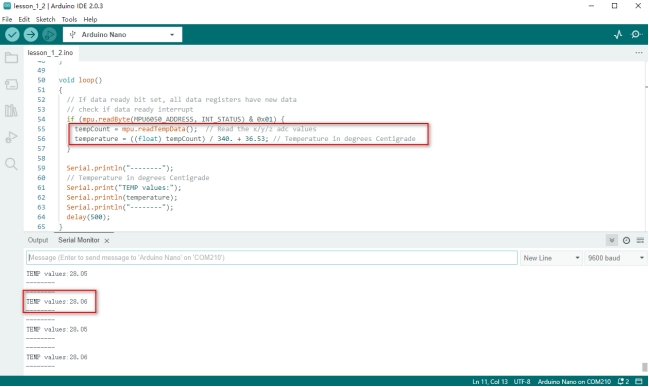 

------


###  **MPU6050 Attitude**

Make an Attitude Fusion Solution on the accelerometer and gyroscope data. 

To solve problems of universal joint deadlock of Euler Angles and to simplify calculation, a quaternion (three real numbers and an imaginary number) is adopted to represent the attitude in an Attitude Fusion Solution.

After processing, the quaternion converts into Euler Angle, which gets more precise rotation information to control drones, mobile robots and other devices.

------


####  **Attitude**

MPU6050 measures the attitude of an object in three dimensions: Roll, Pitch and Yaw. It also detects the acceleration to gain the speed and position after calculation. 

 

Three-Axis: 

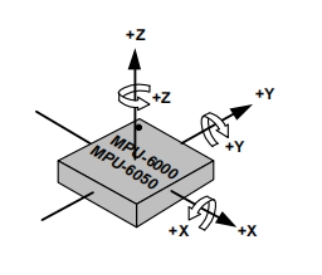 

An Euler Angle is a rotation angle of an object in three dimensional space whose axis is arbitrarily adjustable.

It includes three angles: Roll Angle, Pitch Angle and Yaw Angle:  

| ***Roll Angle*** | **A rotation angle with x-axis as the rotational axis** |
| ---------------- | ------------------------------------------------------- |
| **Pitch Angle**  | **A rotation angle with y-axis as the rotational axis** |
| **Yaw Angle**    | **A rotation angle with z-axis as the rotational axis** |

 

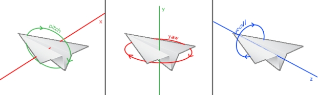 

 

 

When acquiring Yaw Angle, MPU6050 internal gyroscope automatically calibrates and sets its own angle to 0, which will cause a Yaw Angle Null Shift. 

Null shift, which is unavoidable and limited by hardware, is an effect that the detected data occasionally drifts from its null point. 

Therefore, we add a magnetometer to calibrate MPU6050. 

***\*Hence, in the following tutorials, our main contents are Roll Angle and Pitch Angle.\****

------


####  **Acquire Attitude**

In a filtering algorithm, errors reduce and 6-axis data are converted into quaternions, which will then convert to Euler Angle to indicate the concrete data of attitude. 

------

Ways to acquire quaternions:

1. Use the built-in DMP. An embedded motion driver library is prepared for outputting attitude solutions quaternions.
2. Use the high-efficiency locating filter of Sebastian Madgwick.

------

This filter adopts a modelless estimation algorithm to estimate the attitude for inertia/magnetic sensor arrays.

The computational intensity of the quaternion filtering algorithm is much small. This is the reason why it can operate on Arduino Pro Mini development board with a speed of 8MHz. 

In the algorithm, the change angle is expressed as a quaternion, and it effectively filters out noises and reduces positioning errors.

------

Attitude estimation formula: 


$$
(Δφ = qt * qt-1)
$$

$$
qt+1 = qt + (1/α) * Δφ
$$


Δφ: the difference value of quaternions, which represents the change angle between two quaternons. 

qt: the current quaternon (present attitude)

qt-1: the last read quaternon (last attitude)

qt+1: the next quaternon (next attitude), which is calculated through the current quaternion and its difference.

α: an adjustable parameter, which controls the sensitivity of the filter.

------


####  **Wiring**

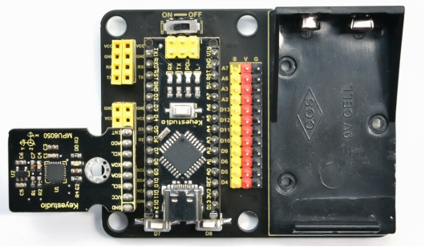

Install MPU6050 on the expansion board and connect it to your computer via USB cable.

------


#### **Attitude Acquiring Process**

 

#####  **Convert Accelerometer Data**

Convert the underlying data of accelerometer into the actual data.

Acceleration Calculation Formula: 


$$
Acceleration=\frac{Original Acceleration Value}{Data Resolution}(m/s^2)
$$


For example, set the scale to ±2g. If the reading of ADC is ±32768，ADC value of 1g is +32768/2=16384LSB/g. 

 

***\*Code:\**** 

```c++
mpu.readAccelData(accelCount); //Read the x/y/z adc values

aRes = mpu.getAres();

//Now we'll calculate the accleration value into actual g's	

ax = (float)accelCount[0] * aRes; //get actual g value, this depends on scale being set

ay = (float)accelCount[1] * aRes;

az = (float)accelCount[2] * aRes;
```

------


#####  **Convert Gyroscope Data**

Convert the underlying data of gyroscope into the actual data.

Angular Speed Calculation Formula:


$$
Angular Speed=\frac{Original Angular Speed Value}{Data Resolution}(°/s)
$$


ADC output range is ±32768. 

If we set the measuring range to ±2000°/s, and original ADC reading is 300, the data resolution will be 32768/2000=16.384LSB/(°/s), and the angular speed will be 300/16.384=18.3105(°/s). 

 

***\*Code:\**** 

```c++
mpu.readGyroData(gyroCount);    // Read the x/y/z adc values

gRes = mpu.getGres();       //Acquire the converted value

 

// Calculate the gyro value into actual degrees per second

gyrox = (float)gyroCount[0] * gRes; // get actual gyro value, this depends on scale being set

gyroy = (float)gyroCount[1] * gRes;

gyroz = (float)gyroCount[2] * gRes;
```

------


#####  **Calculate Integration Interval**

Acquire the time to calculate the integration interval, and convert it to quaternion .

***\*Code:\**** 

```c++
// Acquire the current time of the system in ms

 Now = micros();

 // set integration time by time elapsed since last filter update

 deltat = ((Now - lastUpdate) / 1000000.0f);

 lastUpdate = Now;

 if(lastUpdate - firstUpdate > 10000000uL) {

  beta = 0.041; // decrease filter gain after stabilized

  zeta = 0.015; // increase gyro bias drift gain after stabilized

 }
```

------


##### **Convert 6-Axis Data to Quaternion**

Convert the accelerometer and gyroscope data into quaternion. 

Each axis value needs to be translated into a radian before quaternion conversion. 

According to proportional relation,“gyrox * PI / 180.0f”means the conversion of gyrox angle to radian, as radians belong to angular measurement while angles are circular measurement. 

 

***\*Code:\**** 

```c++
// convert gyroscope data to 

gyrox = gyrox  * PI / 180.0f;

gyroy = gyroy * PI / 180.0f;

gyroz = gyroz * PI / 180.0f;

// Quaternion conversion function

MadgwickQuaternionUpdate(ax, ay, az, gyrox, gyroy, gyroz);
```

------


#####  **Quaternion Conversion Function**

Quaternion filter computational function. 

Define variables, including bias, auxiliary operation values, norm and Jacobian elements.

1. First calculate the vector norm of acceleration, and its norm is the length of vector. Here is the formula: 

   
   $$
   norm = sqrt (ax * ax + ay * ay + az * az)
   $$
   

​		(ax, ay and az respectively means the acceleration on axis x, y and z)

2. Calculate Jacobian. 
3. Compute the gradient via Jacobian multiplication. 
4. Normalize gradient. 
5. Compute estimated gyroscope biases.
6. Compute and remove gyroscope biases.
7. Compute the quaternion derivative.
8. Integrate estimated quaternion derivative.
9. Normalize the quaternion.

 

***\*Code:\**** 

```c++
// Implementation of Sebastian Madgwick's "...efficient orientation filter for... inertial/magnetic sensor arrays"

// which fuses acceleration and rotation rate to produce a quaternion-based estimate of relative

// device orientation -- which can be converted to yaw, pitch, and roll. Useful for stabilizing quadcopters, etc.

// The performance of the orientation filter is at least as good as conventional Kalman-based filtering algorithms

// but is much less computationally intensive---it can be performed on a 3.3 V Pro Mini operating at 8 MHz!

void MadgwickQuaternionUpdate(float ax, float ay, float az, float gyrox, float gyroy, float gyroz)

{

// short name local variable for readability

float q1 = q[0], q2 = q[1], q3 = q[2], q4 = q[3]; 

// vector norm    

float norm;

// objective function elements

float f1, f2, f3;

// objective function Jacobian elements

float J_11or24, J_12or23, J_13or22, J_14or21, J_32, J_33; 

float qDot1, qDot2, qDot3, qDot4;

float hatDot1, hatDot2, hatDot3, hatDot4;

// gyro bias error

float gerrx, gerry, gerrz, gbiasx, gbiasy, gbiasz;

// Auxiliary variables to avoid repeated arithmetic

float _halfq1 = 0.5f * q1;

float _halfq2 = 0.5f * q2;

float _halfq3 = 0.5f * q3;

float _halfq4 = 0.5f * q4;

float _2q1 = 2.0f * q1;

float _2q2 = 2.0f * q2;

float _2q3 = 2.0f * q3;

float _2q4 = 2.0f * q4;

float _2q1q3 = 2.0f * q1 * q3;

float _2q3q4 = 2.0f * q3 * q4;

 

// Normalize accelerometer measurement

norm = sqrt(ax * ax + ay * ay + az * az);

if (norm == 0.0f) return; // handle NaN

norm = 1.0f/norm;

ax *= norm;

ay *= norm;

az *= norm;

 

// Compute the objective function and Jacobian

f1 = _2q2 * q4 - _2q1 * q3 - ax;

f2 = _2q1 * q2 + _2q3 * q4 - ay;

f3 = 1.0f - _2q2 * q2 - _2q3 * q3 - az;

J_11or24 = _2q3;

J_12or23 = _2q4;

J_13or22 = _2q1;

J_14or21 = _2q2;

J_32 = 2.0f * J_14or21;

J_33 = 2.0f * J_11or24;

 

// Compute the gradient (matrix multiplication)

hatDot1 = J_14or21 * f2 - J_11or24 * f1;

hatDot2 = J_12or23 * f1 + J_13or22 * f2 - J_32 * f3;

hatDot3 = J_12or23 * f2 - J_33 *f3 - J_13or22 * f1;

hatDot4 = J_14or21 * f1 + J_11or24 * f2;

 

// Normalize the gradient

norm = sqrt(hatDot1 * hatDot1 + hatDot2 * hatDot2 + hatDot3 * hatDot3 + hatDot4 * hatDot4);

hatDot1 /= norm;

hatDot2 /= norm;

hatDot3 /= norm;

hatDot4 /= norm;

 

// Compute estimated gyroscope biases

gerrx = _2q1 * hatDot2 - _2q2 * hatDot1 - _2q3 * hatDot4 + _2q4 * hatDot3;

gerry = _2q1 * hatDot3 + _2q2 * hatDot4 - _2q3 * hatDot1 - _2q4 * hatDot2;

gerrz = _2q1 * hatDot4 - _2q2 * hatDot3 + _2q3 * hatDot2 - _2q4 * hatDot1;

 

// Compute and remove gyroscope biases

gbiasx += gerrx * deltat * zeta;

gbiasy += gerry * deltat * zeta;

gbiasz += gerrz * deltat * zeta;

gyrox -= gbiasx;

gyroy -= gbiasy;

gyroz -= gbiasz;

 

// Compute the quaternion derivative

qDot1 = -_halfq2 * gyrox - _halfq3 * gyroy - _halfq4 * gyroz;

qDot2 =  _halfq1 * gyrox + _halfq3 * gyroz - _halfq4 * gyroy;

qDot3 =  _halfq1 * gyroy - _halfq2 * gyroz + _halfq4 * gyrox;

qDot4 =  _halfq1 * gyroz + _halfq2 * gyroy - _halfq3 * gyrox;

 

// Compute then integrate estimated quaternion derivative

q1 += (qDot1 -(beta * hatDot1)) * deltat;

q2 += (qDot2 -(beta * hatDot2)) * deltat;

q3 += (qDot3 -(beta * hatDot3)) * deltat;

q4 += (qDot4 -(beta * hatDot4)) * deltat;

 

// Normalize the quaternion

norm = sqrt(q1 * q1 + q2 * q2 + q3 * q3 + q4 * q4);   // normalize quaternion

norm = 1.0f/norm;

q[0] = q1 * norm;

q[1] = q2 * norm;

q[2] = q3 * norm;

q[3] = q4 * norm;

}
```

------

 

##### **Convert Quaternion to Euler Angle**

Conversion Formula: 


$$
Yaw(z) = atan2(2*(w*z+x*y), 1-2*(z^2+x^2))
$$


$$
Pitch(y) = asin(2*(w*y-z*x))
$$


$$
Roll(x) = atan2(2*(w*x+y*z), 1-2*(x^2+y^2))
$$


***\*Code:\**** 

```c++
yaw = atan2(2.0f * (q[1] * q[2] + q[0] * q[3]), q[0] * q[0] + q[1] * q[1] - q[2] * q[2] - q[3] * q[3]);

pitch = -asin(2.0f * (q[1] * q[3] - q[0] * q[2]));

roll  = atan2(2.0f * (q[0] * q[1] + q[2] * q[3]), q[0] * q[0] - q[1] * q[1] - q[2] * q[2] + q[3] * q[3]);


pitch *= 180.0f / PI;

yaw  *= 180.0f / PI;

roll  *= 180.0f / PI;
```

------

 

####  **Test Result**

Download the code to Arduino NANO. 

Keep MPU6050 balanced and press the reset button. 

Open the serial port after 3~5s.

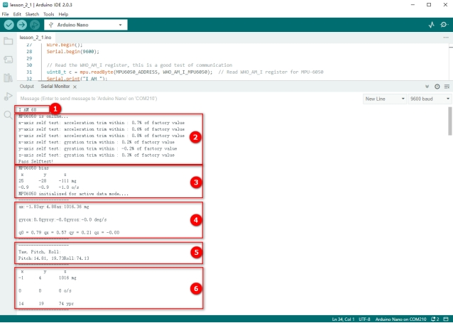 

1. Acquire ID：0x68 of MPU6050
2. Self-test and print the test value. 
3. Calibrate and print the calibration value, and then initialize. 
4. Acquire accelerometer and gyroscope data and the quaternion.
5. Acquire the converted Euler Angle. 
6. Acquire the data of accelerometer, gyroscope and Euler Angle in axis X, Y and Z.

------


####  **Test Code:**

**Please refer to the folder lesson_2_1.**

[lesson_2_1.ino]:

```c++
#include "MPU6050.h"

MPU6050lib mpu;

float aRes, gRes;        // scale resolutions per LSB for the sensors

int16_t accelCount[3];      // Stores the 16-bit signed accelerometer sensor output

int16_t gyroCount[3];      // Stores the 16-bit signed gyro sensor output

float ax, ay, az;        // Stores the real accel value in g's

float gyrox, gyroy, gyroz;    // Stores the real gyro value in degrees per seconds

float gyroBias[3] = {0, 0, 0};

float accelBias[3] = {0, 0, 0}; // correct gyro and accelerometer bias

int16_t tempCount;        // Stores the real internal chip temperature in degrees Celsius

float temperature;

float SelfTest[6];

float q[4] = {1.0f, 0.0f, 0.0f, 0.0f};// vector to hold quaternion

float pitch, yaw, roll;

// parameters for 6 DoF sensor fusion calculations

float GyroMeasError = PI * (40.0f / 180.0f);    // gyroscope measurement error in rads/s (start at 60 deg/s), then reduce after ~10 s to 3

float beta = sqrt(3.0f / 4.0f) * GyroMeasError;  // compute beta(β)

float GyroMeasDrift = PI * (2.0f / 180.0f);    // gyroscope measurement drift in rad/s/s (start at 0.0 deg/s/s)

float zeta = sqrt(3.0f / 4.0f) * GyroMeasDrift;  // compute zeta, the other free parameter in the Madgwick scheme usually set to a small or zero value

float deltat = 0.0f;                // integration interval for both filter schemes

uint32_t lastUpdate = 0, firstUpdate = 0;     // used to calculate integration interval

uint32_t Now = 0;                 // used to calculate integration interval

 

void setup()

{

 Wire.begin();

 Serial.begin(9600);

 

 // Read the WHO_AM_I register, this is a good test of communication

 uint8_t c = mpu.readByte(MPU6050_ADDRESS, WHO_AM_I_MPU6050); // Read WHO_AM_I register for MPU-6050

 Serial.print("I AM ");

 Serial.println(c, HEX);

 

 mpu.settings(AFS_8G, GFS_250DPS);

 if (c == 0x68) // WHO_AM_I should always be 0x68

 {

  Serial.println("MPU6050 is online...");

  // Start by performing self test and reporting values

  mpu.MPU6050SelfTest(SelfTest); 

  Serial.print("x-axis self test: acceleration trim within : "); Serial.print(SelfTest[0],1); Serial.println("% of factory value");

  Serial.print("y-axis self test: acceleration trim within : "); Serial.print(SelfTest[1],1); Serial.println("% of factory value");

  Serial.print("z-axis self test: acceleration trim within : "); Serial.print(SelfTest[2],1); Serial.println("% of factory value");

  Serial.print("x-axis self test: gyration trim within : "); Serial.print(SelfTest[3],1); Serial.println("% of factory value");

  Serial.print("y-axis self test: gyration trim within : "); Serial.print(SelfTest[4],1); Serial.println("% of factory value");

  Serial.print("z-axis self test: gyration trim within : "); Serial.print(SelfTest[5],1); Serial.println("% of factory value");

 

  if (SelfTest[0] < 1.0f && SelfTest[1] < 1.0f && SelfTest[2] < 1.0f && SelfTest[3] < 1.0f && SelfTest[4] < 1.0f && SelfTest[5] < 1.0f) {

   Serial.println("Pass Selftest!");

   // Calibrate gyro and accelerometer, load biases in bias registers

   mpu.calibrateMPU6050(gyroBias, accelBias); 

   Serial.println("MPU6050 bias");

   Serial.println(" x\t  y\t  z  ");

   Serial.print((int)(1000 * accelBias[0])); Serial.print('\t');

   Serial.print((int)(1000 * accelBias[1])); Serial.print('\t');

   Serial.print((int)(1000 * accelBias[2]));

   Serial.println(" mg");

 

   Serial.print(gyroBias[0], 1); Serial.print('\t');

   Serial.print(gyroBias[1], 1); Serial.print('\t');

   Serial.print(gyroBias[2], 1);

   Serial.println(" o/s");

 

   mpu.settings(AFS_2G, GFS_250DPS);

   mpu.initMPU6050(); 

   // Initialize device for active mode read of accelerometer , gyroscope, and temperature

   

   Serial.println("MPU6050 initialized for active data mode...."); 

  }

 }

 else

 {

  Serial.print("Could not connect to MPU6050: 0x");

  Serial.println(c, HEX);

  while(1); // Loop forever if communication doesn't happen

 }

}

 

void loop()

{

 // If data ready bit set, all data registers have new data

 if (mpu.readByte(MPU6050_ADDRESS, INT_STATUS) & 0x01) { // check if data ready interrupt

  mpu.readAccelData(accelCount);   // Read the x/y/z adc values

  aRes = mpu.getAres();       // Acquire the converted value

 

  // Now we'll calculate the accleration value into actual g's

  ax = (float)accelCount[0] * aRes; // get actual g value, this depends on scale being set

  ay = (float)accelCount[1] * aRes;

  az = (float)accelCount[2] * aRes;

 

  mpu.readGyroData(gyroCount);    // Read the x/y/z adc values

  gRes = mpu.getGres();       // Acquire the converted value

 

  // Calculate the gyro value into actual degrees per second

  gyrox = (float)gyroCount[0] * gRes; // get actual gyro value, this depends on scale being set

  gyroy = (float)gyroCount[1] * gRes;

  gyroz = (float)gyroCount[2] * gRes;

 

  tempCount = mpu.readTempData(); // Read the x/y/z adc values

  temperature = ((float) tempCount) / 340. + 36.53; // Temperature in degrees Centigrade

 }

 // Acquire the current time of the system in ms 

 Now = micros();

 // set integration time by time elapsed since last filter update

 deltat = ((Now - lastUpdate) / 1000000.0f);

 lastUpdate = Now;

 if(lastUpdate - firstUpdate > 10000000uL) {

  beta = 0.041; // decrease filter gain after stabilized

  zeta = 0.015; // increase gyro bias drift gain after stabilized

 }

 // Convert the gyroscope data to radians

 gyrox = gyrox  * PI / 180.0f;

 gyroy = gyroy * PI / 180.0f;

 gyroz = gyroz * PI / 180.0f;

 // Quaternion conversion function

 MadgwickQuaternionUpdate(ax, ay, az, gyrox, gyroy, gyroz);

 

 Serial.println("--------------------");

 Serial.print("ax:"); Serial.print((int)1000*ax);

 Serial.print("ay:"); Serial.print((int)1000*ay);

 Serial.print("az:"); Serial.print((int)1000*az); Serial.println(" mg");

 

 Serial.println("  ");

 Serial.print("gyrox:"); Serial.print( gyrox, 1);

 Serial.print("gyroy:"); Serial.print( gyroy, 1);

 Serial.print("gyroz:"); Serial.print( gyroz, 1); Serial.println(" deg/s");

 

 Serial.println("  ");

 Serial.print(" q0 = "); Serial.print(q[0]);

 Serial.print(" qx = "); Serial.print(q[1]);

 Serial.print(" qy = "); Serial.print(q[2]);

 Serial.print(" qz = "); Serial.println(q[3]);

 Serial.println("--------------------");

 

 // Define output variables from updated quaternion---these are Tait-Bryan angles, commonly used in aircraft orientation.

 // In this coordinate system, the positive z-axis is down toward Earth.

 // Yaw is the angle between Sensor x-axis and Earth magnetic North (or true North if corrected for local declination, looking down on the sensor positive yaw is counterclockwise.

 // Pitch is angle between sensor x-axis and Earth ground plane, toward the Earth is positive, up toward the sky is negative.

 // Roll is angle between sensor y-axis and Earth ground plane, y-axis up is positive roll.

 // These arise from the definition of the homogeneous rotation matrix constructed from quaternions.

 // Tait-Bryan angles as well as Euler angles are non-commutative; that is, the get the correct orientation the rotations must be

 // applied in the correct order which for this configuration is yaw, pitch, and then roll.

 yaw  = atan2(2.0f * (q[1] * q[2] + q[0] * q[3]), q[0] * q[0] + q[1] * q[1] - q[2] * q[2] - q[3] * q[3]);

 pitch = -asin(2.0f * (q[1] * q[3] - q[0] * q[2]));

 roll  = atan2(2.0f * (q[0] * q[1] + q[2] * q[3]), q[0] * q[0] - q[1] * q[1] - q[2] * q[2] + q[3] * q[3]);

 

 pitch *= 180.0f / PI;

 yaw  *= 180.0f / PI;

 roll  *= 180.0f / PI;

 

 Serial.println("--------------------");

 // Serial.println("Yaw\t Pitch\t Roll: ");

 Serial.print("Yaw:");

 Serial.print(yaw, 2);

 Serial.print("°");

 Serial.print("\tPitch:");

 Serial.print(pitch, 2);

 Serial.print("°");

 Serial.print("\tRoll:");

 Serial.print(roll, 2);

 Serial.println("°");

 Serial.println("--------------------");

 

 Serial.println(" x\t  y\t  z  ");

 

 Serial.print((int)(1000 * ax)); Serial.print('\t');

 Serial.print((int)(1000 * ay)); Serial.print('\t');

 Serial.print((int)(1000 * az));

 Serial.println(" mg");

 Serial.println("  ");

 Serial.print((int)(gyrox)); Serial.print('\t');

 Serial.print((int)(gyroy)); Serial.print('\t');

 Serial.print((int)(gyroz));

 Serial.println(" o/s");

 Serial.println("  ");

 Serial.print((int)(yaw)); Serial.print('\t');

 Serial.print((int)(pitch)); Serial.print('\t');

 Serial.print((int)(roll));

 Serial.println(" ypr");

 Serial.println("--------------------");

 

 delay(100);

}

 

// Implementation of Sebastian Madgwick's "...efficient orientation filter for... inertial/magnetic sensor arrays"

// which fuses acceleration and rotation rate to produce a quaternion-based estimate of relative

// device orientation -- which can be converted to yaw, pitch, and roll. Useful for stabilizing quadcopters, etc.

// The performance of the orientation filter is at least as good as conventional Kalman-based filtering algorithms

// but is much less computationally intensive---it can be performed on a 3.3 V Pro Mini operating at 8 MHz!

void MadgwickQuaternionUpdate(float ax, float ay, float az, float gyrox, float gyroy, float gyroz)

{

 float q1 = q[0], q2 = q[1], q3 = q[2], q4 = q[3];     // short name local variable for readability

 float norm;                        // vector norm

 float f1, f2, f3;                     // objective function elements

 float J_11or24, J_12or23, J_13or22, J_14or21, J_32, J_33; // objective function Jacobian elements

 float qDot1, qDot2, qDot3, qDot4;

 float hatDot1, hatDot2, hatDot3, hatDot4;

 float gerrx, gerry, gerrz, gbiasx, gbiasy, gbiasz;     // gyro bias error

 

 // Auxiliary variables to avoid repeated arithmetic

 float _halfq1 = 0.5f * q1;

 float _halfq2 = 0.5f * q2;

 float _halfq3 = 0.5f * q3;

 float _halfq4 = 0.5f * q4;

 float _2q1 = 2.0f * q1;

 float _2q2 = 2.0f * q2;

 float _2q3 = 2.0f * q3;

 float _2q4 = 2.0f * q4;

 float _2q1q3 = 2.0f * q1 * q3;

 float _2q3q4 = 2.0f * q3 * q4;

 

 // Normalise accelerometer measurement

 norm = sqrt(ax * ax + ay * ay + az * az);

 if (norm == 0.0f) return; // handle NaN

 norm = 1.0f/norm;

 ax *= norm;

 ay *= norm;

 az *= norm;

 

 // Compute the objective function and Jacobian

 f1 = _2q2 * q4 - _2q1 * q3 - ax;

 f2 = _2q1 * q2 + _2q3 * q4 - ay;

 f3 = 1.0f - _2q2 * q2 - _2q3 * q3 - az;

 J_11or24 = _2q3;

 J_12or23 = _2q4;

 J_13or22 = _2q1;

 J_14or21 = _2q2;

 J_32 = 2.0f * J_14or21;

 J_33 = 2.0f * J_11or24;

 

 // Compute the gradient (matrix multiplication)

 hatDot1 = J_14or21 * f2 - J_11or24 * f1;

 hatDot2 = J_12or23 * f1 + J_13or22 * f2 - J_32 * f3;

 hatDot3 = J_12or23 * f2 - J_33 *f3 - J_13or22 * f1;

 hatDot4 = J_14or21 * f1 + J_11or24 * f2;

 

 // Normalize the gradient

 norm = sqrt(hatDot1 * hatDot1 + hatDot2 * hatDot2 + hatDot3 * hatDot3 + hatDot4 * hatDot4);

 hatDot1 /= norm;

 hatDot2 /= norm;

 hatDot3 /= norm;

 hatDot4 /= norm;

 

 // Compute estimated gyroscope biases

 gerrx = _2q1 * hatDot2 - _2q2 * hatDot1 - _2q3 * hatDot4 + _2q4 * hatDot3;

 gerry = _2q1 * hatDot3 + _2q2 * hatDot4 - _2q3 * hatDot1 - _2q4 * hatDot2;

 gerrz = _2q1 * hatDot4 - _2q2 * hatDot3 + _2q3 * hatDot2 - _2q4 * hatDot1;

 

 // Compute and remove gyroscope biases

 gbiasx += gerrx * deltat * zeta;

 gbiasy += gerry * deltat * zeta;

 gbiasz += gerrz * deltat * zeta;

 gyrox -= gbiasx;

 gyroy -= gbiasy;

 gyroz -= gbiasz;

 

 // Compute the quaternion derivative

 qDot1 = -_halfq2 * gyrox - _halfq3 * gyroy - _halfq4 * gyroz;

 qDot2 =  _halfq1 * gyrox + _halfq3 * gyroz - _halfq4 * gyroy;

 qDot3 =  _halfq1 * gyroy - _halfq2 * gyroz + _halfq4 * gyrox;

 qDot4 =  _halfq1 * gyroz + _halfq2 * gyroy - _halfq3 * gyrox;

 // Compute then integrate estimated quaternion derivative

 q1 += (qDot1 -(beta * hatDot1)) * deltat;

 q2 += (qDot2 -(beta * hatDot2)) * deltat;

 q3 += (qDot3 -(beta * hatDot3)) * deltat;

 q4 += (qDot4 -(beta * hatDot4)) * deltat;

 // Normalize the quaternion

 norm = sqrt(q1 * q1 + q2 * q2 + q3 * q3 + q4 * q4);   // 标准化四元数 normalise quaternion

 norm = 1.0f/norm;

 q[0] = q1 * norm;

 q[1] = q2 * norm;

 q[2] = q3 * norm;

 q[3] = q4 * norm;

}
```

------


###  **BT Receiving and Sending**

 

####  **Bluetooth Module**

Bluetooth Module Host (Straight pins): 

 

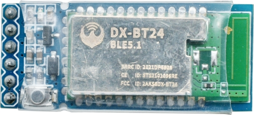 

 

Bluetooth Module Slave (Curved pins): 

 

 

DX-BT24 adopts DIALOG 14531 chip, which supports AT commands and UART communication, and obeys BT BLE5.1 protocol. 

The most important merits are its flexibility to adjust baud rate and device name, low costs, low consumption as well as high receiving sensitivity. 

------

***\*Features:\**** 

- DIALOG14531 main control chip

- BT BLE5.1 protocol 

- Minimum power consumption: 2 uA.

- Visual distance: 90M for slave module; 20M for main module

- Transmitting speed: 10K Bytes/s

- UART communication

- Support iBeacon mode programs

- Direct-drive and single-host programs for options

- One host - to - many slave modules programs


------

***\*Circuit diagram:\**** 

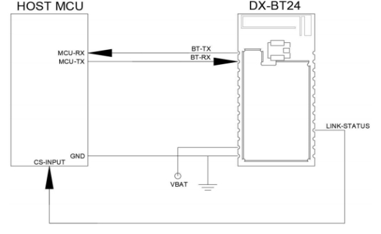 

------

Working modes: 

|      **Modes**       |                        **Functions**                         |
| :------------------: | :----------------------------------------------------------: |
|     Normal Mode      | All functions of peripheral interfaces are in a normal state. |
| Low Consumption Mode | Disconnection: Only broadcast is enabled, while all peripheral interfaces are disabled.Connection: Same as the normal mode. |
|      Sleep Mode      | All RAMs stop working.Only a built-in ticking clock is left to awakening the module.Peripheral interfaces and the broadcast are all disabled. |

------

UART interface: the default parameter of the serial port: 9600bps/8/n/1 (Baud rate/data bit/none check/stop bit). 

|    **Parameters**     |                          **Values**                          |
| :-------------------: | :----------------------------------------------------------: |
|       Baud rate       | Minimum: 2400baud (≤1%Error),Standard: 9600baud (≤1%Error),Maximum: 115200baud (≤1%Error) |
|     Parity check      |                      None/ even or odd                       |
|       Stop bit        |                             1/2                              |
| Bits for each channel |                              8                               |

------


**BT control:** Control BT by AT commands. 

AT command (AT function and AT parameter) is a collection to control common Bluetooth operations, including connecting and disconnecting, searching and pairing, sending and receiving. 

AT parameter specifies AT function, such as pairing codes, connecting address and time interval as well as the length of sending data.

------


**AT command and transmitting mode:** 

- AT command mode: The module will response commands if it disconnects any slave devices. 


- Transmitting mode: The module will transmit data if it connects devices. 


------


**Connections between BT devices:** A device address (MAC address) identifies a unique physical device. In other words, uniqueness (in a certain distance) is a very significant feature of an address. 

------


A BLE device utilizes one (or both) of the two types of addresses: **Public Device Address and Random Device Address.**

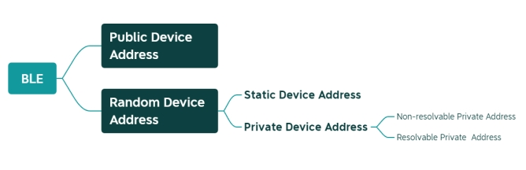 

------

**Public Device Address:**

It is originated from the classic Bluetooth (BR/EDR) address, which is a 48bits (6 bytes) number and also called“48-bit universal LAN MAC address”(same as computer MAC address). 

Normally, the address holder must apply to IEEE to pay for it to ensure its uniqueness.

------

**Static Device Address:**

It is generated at random during device working.

------

 

####  **AT** **Commands**

AT commands are text instructions to integrate the computer and Bluetooth via serial port, and they are used for status and function enquiry, parameter configuration and connection state. 

Generally, we connect device to Bluetooth through USB-to-serial port to manipulate the BT module. 

------

 

 **AT** **Command Format for Sending:** 

**AT+Command<param1,param2,param3> < CR >< CF >**

- All commands begin with“AT”and end in“< CR >< LF >”. In following figures we will omit “< CR >< LF >”. 

- All letters should be capitals. 

- Contents in“<>”means options. 

- If a command includes multiple parameters, they should be separated by“，”.

- Real commands exclude“<>”.  

- < CR > indicates a carriage-return-character“\r”and OXOD symbolizes hexadecimal.
- The line-feed-character is signaled as < LF > and OXOA represents hexadecimal. 

- If commands execute successfully, the relevant output will end with OK. If not, it outputs EEROR=<> (error codes in“<>”).


------


 **AT** **Command Format for Receiving:** 

**+Indication<=param1,param2,param3>< CR >< CF >**

- A response command starts with“+”and ends in< CR >< CF >.

- “=”follows response parameters. 

- If a response includes multiple parameters, they will be separated by“，”.


------

 

 **An AT Command Example:** 

**Revise the Bluetooth name as 1234**

- Send: AT+NAME1234

- Receive：+NAME=1234


​						OK

 

For more commands, please refer to [5.6.5](#AT Command Collection) and the data sheet.

------


####  **Wiring**

Connect Bluetooth to the device via USB-to-serial port module. 

***\*Note: Installations of hosts and slave devices are totally same.\****

Keyestudio FTDI (original chips) Basic Program: https://www.keyestudio.com/search/?Keyword=ks0277

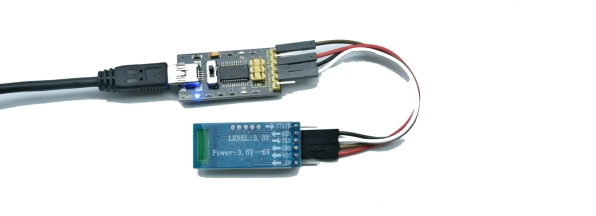 

 

Connection Description: 

| **USB-to-serial port** | **Host & slave Bluetooth** |
| :--------------------: | :------------------------: |
|           RX           |             TX             |
|           TX           |             RX             |
|          VCC           |            VCC             |
|          GND           |            GND             |

------


####  **Control BT by** **AT** **Commands**

The Bluetooth responds to AT commands when it disconnects to any slave devices.

 

***\*Note: All letters in a command should be capitals!\****

 

#####  **Operate Host Devices**

Create a blank project in Arduino IDE to select the Port: 

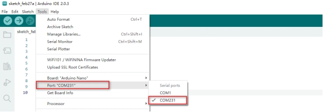 

------


Set baud rate as 9600 (the host is 9600 by default), and input AT to send your command. If the module receives it, OK will be output. 

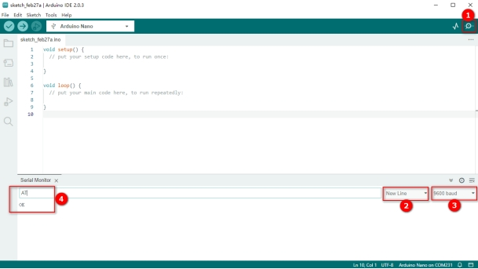 

------


**Query version number:** Input AT+VERSION to display the version number . 

 

------


**Revise BT name:** Input AT+NAMEBT24 Master to revise it name as BT24 Master then it will be output. 

**Query BT name:** AT+NAME.

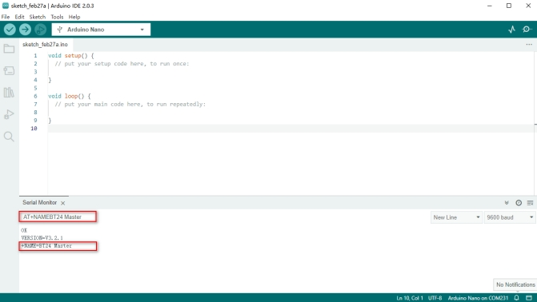 

------

 

| NO.       |  1   |  2   |  3   |   4   |   5   |   6   |   7    | Default Value |
| --------- | :--: | :--: | :--: | :---: | :---: | :---: | :----: | :-----------: |
| Baud Rate | 2400 | 4800 | 9600 | 19200 | 38400 | 57600 | 115200 |     9600      |

**Set baud rate:** Input AT+BAUD7 to set baud rate to 115200. If the module communicates with other devices, their baud rate should also be 115200.

 

------


**Set searching mode:** 

| **NO.** |            **Functions**            | **Commands** |                       **Description**                        |
| :-----: | :---------------------------------: | :----------: | :----------------------------------------------------------: |
|    1    |       Query thesearching mode       |   AT+MODE    |              Query the current searching mode.               |
|    2    |        Normal mode(default)         |   AT+MODE0   | All surrounding BLE devices can be searched. Note: Connect BT24 series only. |
|    3    | Manufacturer informationfilter mode |   AT+MODE1   | Filter manufacturer information: Only information of BT24 series can be searched. |
|    4    |            pairing mode             |   AT+MODE2   |         Only pairing slave devices can be detected.          |
|    5    |     Obtain IBEACON information      |   AT+MODE3   | Surrounding IBeacon broadcasting package information can be obtained by scanning. |

 

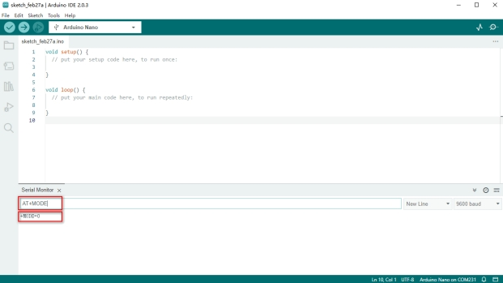 

For more commands, please refer to [5.6.5](#AT Command Collection)and DX-BT24 data sheet.

------


#####  **Operate Slave Devices**

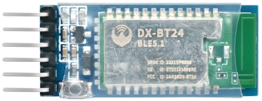 

**Note: This BT24 module is not included in kits.** 

Keyestudio bt-24 Module RS232/TTL to UART:

https://www.keyestudio.com/products/keyestudio-wireless-data-transmission-dailog-14531-chip-dx-bt24-v51-bluetooth-module-

Open Arduino IDE and set serial port and baud rate. 

Input AT to test communication. If it is successful, OK will be output.

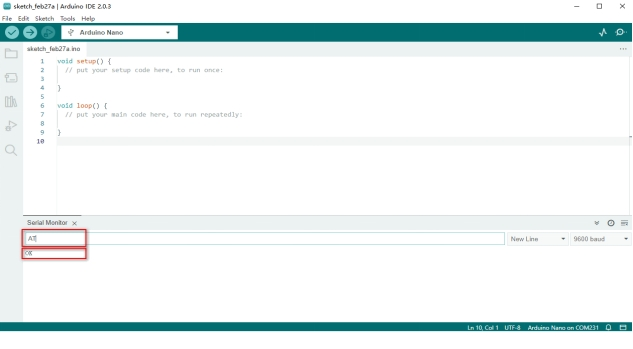 

**Query version number:** Input AT+VERSION to output the version number . 

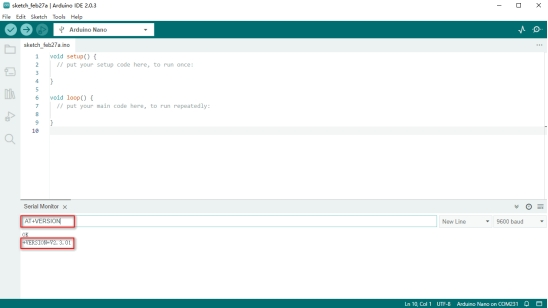 

**Query BT name:** AT+NAME.

**Revise BT name:** Input AT+NAMEBT24 Slave to revise its name as BT24 Slave.

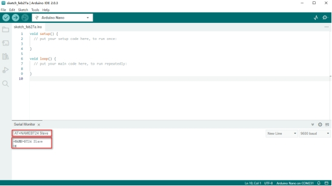 

**Query MAC address** (an exclusive command for slave devices): Input AT+LADDR to show MAC address. 

(Hosts connect to slave devices through MAC address.)

 

------

 

####  **AT Command Collection**

These commands apply to BT24 Bluetooth Module.

Keyestudio bt-24 Module RS232/TTL to UART: https://www.keyestudio.com/search/?Keyword=bt-24

**Note: Only hosts are privileged to visit and set MODE, and only slave devices are authorized to query address. After setting commands, you need to reset the Bluetooth module.**

Commands for host devices: 

| **NO.** |          **Functions**           |    **Commands**    |                         **Response**                         |                       **Description**                        |
| :-----: | :------------------------------: | :----------------: | :----------------------------------------------------------: | :----------------------------------------------------------: |
|    1    |           Test Command           |         AT         |                              OK                              |                       Test serial port                       |
|    2    |       Query version number       |     AT+VERSION     |                      +VERSION=<version>                      | <version > : Version numberIt varies from modules and customized demand. |
|    3    |        Query MAC address         |      AT+LADDR      |                        +LADDR=<laddr>                        |                 <laddr> BT MAC address code                  |
|    4    |          Query BT name           |      AT+NAME       |                         +NAME=<name>                         |    <name>: BT name, maximum of 28 bytesDefault name: BT24    |
|    5    |           Set BT name            |   AT+NAME<name>    |                        +NAME=<name>OK                        |                                                              |
|    6    |    Query serial port stop bit    |      AT+STOP       |                        +STOP=<param>                         | < param>: Serial number0：1 Stop bit1：2 Stop bitDefault value：0 |
|    7    |     Set serial port stop bit     |   AT+STOP<param>   |                       +STOP=<param>OK                        |                                                              |
|    8    |    Queryserial portcheck bit     |      AT+PARI       |                        +PARI=<param>                         | < param>: Serial number0: None check 1: Odd check 2: Even check |
|    9    |    Set serial port check bit     |      AT+PARI       |                       +PARI=<param>OK                        |                                                              |
|   10    |         Query baud rate          |      AT+BAUD       |                         +BAUD=<baud>                         | <baud>: Baud rate serial number1: 2400   5: 384002: 4800   6: 576003: 9600   7: 1152004: 19200Default value: 3 (9600) |
|   11    |          Set baud rate           |   AT+BAUD<baud>    |                        +BAUD=<baud>OK                        |                                                              |
|   12    |       Query searching mode       |      AT+MODE       |                        + MODE<Param>                         | <param>: (0、1、2、3)0: Normal mode1: Manufacturer informationfilter mode 2: pairing mode3: IBEACON information obtaining modeDefault value：0 |
|   13    |        Set searching mode        |   AT+MODE<Param>   |                        +MODE<Parm>OK                         |                                                              |
|   14    |            Disconnect            |      AT+DISC       |                                                              |                                                              |
|   15    |              Reset               |      AT+RESET      |                       +RESETOKPower On                       |                                                              |
|   16    |     Restore factory settings     |     AT+DEFAULT     |                      +DEFAULTOKPower On                      |                                                              |
|   17    | Query filtering signal intensity |    AT+SCANRSSI     |                       +SCANRSSI<rssi>                        | <rssi>: signal intensity1-100 (decimal system)Default value: 100 |
|   18    |  Set filtering signal intensity  | AT+SCANRSSI<rssi>  |                              OK                              |                                                              |
|   19    |       Query searching time       |     AT+TIMEINQ     |                        +TIMEINQ<time>                        |         <time>: time(1-200) *100msDefault value: 10          |
|   20    |        Set searching time        |  AT+TIMEINQ<time>  |                              OK                              |                                                              |
|   21    |       Connect to Bluetooth       |   AT+CONN<param>   |             +Connecting>><mac>+Connected>><mac>              |          <param>: serial number<mac>: address code           |
|   22    |       Search for Bluetooth       |       AT+INQ       | OK+INQS+INQ:<param>,<mac>,<rssi>,<name>+INQ:<param>,<mac>,<rssi>,<name>…+INQEDevices Found <x> | <param>: serial number<mac>: address code: <rssi>: signal value<name>: set name<x>: quantity (max: 8) |
|   23    |       Connect to Bluetooth       |    AT+CONA<mac>    |             +Connecting>><mac>+Connected>><mac>              |                     <mac>: address code                      |
|   24    | Query binding Bluetooth address  |      AT+BIND       |                          +BAND<mac>                          |                     <mac>: address code                      |
|   25    |  Set binding Bluetooth address   |    AT+BIND<mac>    |                              OK                              |                                                              |
|   26    |      Query connection mode       |    AT+AUTOCONN     |                       +AUTOCONN<param>                       | <param>: (0 or 1)0：Disconnected1：ConnectedDefault Value: 0 |
|   27    |       Set connection mode        | AT+AUTOCONN<param> |                              OK                              |                                                              |
|   28    |     Clear connection history     |      AT+CLEAR      |                              OK                              |                                                              |

 

Error code: 

| **NO.** | **Error code** |  **Error description**  |
| :-----: | :------------: | :---------------------: |
|    1    |      101       | Parameter length error  |
|    2    |      102       | Parameter format error  |
|    3    |      103       | Abnormal parameter data |
|    4    |      104       |      Command error      |

 

 

####  **Connect Host to Slave Devices**

Upload AT command to pair host with slave device. The two Bluetooth will connect automatically after being set and powering on. 

Step 1. 

Set baud rate of the host and slave to the same as AT command (Set host first, and here we set baud rate to 115200). Press RESET button. 

Command 1: **AT+BAUD7**

Command 2: **AT+RESET**

 

 

------


Step 2. 

Set host mode to MODE 2. Send AT+MODE and AT+AUTOCONN1.

 

 

 

 

------


Step 3. 

Input AT+SEADV534d4152542d00 to enter slave pairing mode. 

Input AT+CLEARADV to exit. 

 

 

------


Step 4. 

Power up two modules, and the host binds itself to the address code of the slave, and it will keep connection even in an outage. 

Send AT+CLEAR or press a certain button to remove binding.

After connection, LED on the host will light up, while that on the slave will blink per 3s.

 

------


####  **Communication of Host and Slave Device**

Step 1. 

Install host Bluetooth on the expansion board, and burn the test code on Arduino NANO.

**Note: Please keep the Bluetooth disconnected when uploading code.** 

 

Please refer to the folder lesson_3_1.

***\*Code:\**** 

[lesson_3_1.ino]:

```c++
void setup() {

Serial.begin(115200);// Set baud rate to 115200 and initialize the serial port

}

void loop() {

Serial.println("A");

delay(500);

Serial.println("B");

delay(500);

}
```

------

 

Step 2. 

Connect Bluetooth with computer via USB-to-serial port module. Select the serial number and set baud rate to 115200, and the slave receives messages and serial port alternately prints“A”and“B”per 0.5s. 

 

 

------


###  **Operate Mecanum Cars**

Operate the movement of the car by gestures. 

For complete installation, please refer to: [Attachment: Installation Steps](#_附录：安装步骤)

Mecanum cars: https://www.keyestudio.com/search/?Keyword=mecanum

 

------

This glove controls not only Mecanum cars but also mini tanks, smart homing cars and Beetlebot cars. 

Other mini cars: https://www.keyestudio.com/search/?&Keyword=car&Sort=4d&page=1

 

------


####  **Angles of the Glove**

A null shift may occur on Yaw if the glove only equipped with MPU6050, hence we only snatch the data of Roll and Pitch. 

***\*If you need full data, please install a magnetometer for calibration.\**** 

Y-axis: Fingers face forward and the palm rolls from side to side.

0°: Stay your hand still. 

\- 180°: Roll down your hand to the left. 

+180°: Roll down your hand to the right.

 

 

------

X-axis: Fingers face forward and the hand moves up and down centered as the palm.

0°: Stay your hand still. 

\- 180°: Move upwards your hand. 

+180°: Move downwards your hand.

 

------


####  **Gesture Angle Code**

Set a range of gesture angles as follows (or at your will). When your gesture reaches the range, the mini car preforms specific actions.

1. Remain horizontal: -10°~10° in axis X and axis Y
2. Roll left: -20~-90° in axis Y
3. Roll right: 20~90° in axis Y
4. Hold upwards: 20~90° in axis X
5. Hold downwards: -20~-90° in axis X

***\*Note: Please keep the Bluetooth disconnected when uploading code.\****

Open serial port after burning the code, and the gesture data is displayed.

 

 

***\*Code:\**** 

[lesson_4_1.ino]:

```c++
#include "MPU6050.h"

MPU6050lib mpu;

 

float aRes, gRes;        // scale resolutions per LSB for the sensors

int16_t accelCount[3];      // Stores the 16-bit signed accelerometer sensor output

int16_t gyroCount[3];      // Stores the 16-bit signed gyro sensor output

float ax, ay, az;        // Stores the real accel value in g's

float gyrox, gyroy, gyroz;    // Stores the real gyro value in degrees per seconds

float gyroBias[3] = {0, 0, 0};

float accelBias[3] = {0, 0, 0}; // Bias corrections for gyro and accelerometer

int16_t tempCount;        // Stores the real internal chip temperature in degrees Celsius

float temperature;

float SelfTest[6];

float q[4] = {1.0f, 0.0f, 0.0f, 0.0f};// vector to hold quaternion

float pitch, yaw, roll;

// parameters for 6 DoF sensor fusion calculations

float GyroMeasError = PI * (40.0f / 180.0f);    //gyroscope measurement error in rads/s (start at 60 deg/s), then reduce after ~10 s to 3

float beta = sqrt(3.0f / 4.0f) * GyroMeasError;  // compute beta(β)

float GyroMeasDrift = PI * (2.0f / 180.0f);    // gyroscope measurement drift in rad/s/s (start at 0.0 deg/s/s)

float zeta = sqrt(3.0f / 4.0f) * GyroMeasDrift;  // compute zeta, the other free parameter in the Madgwick scheme usually set to a small or zero value

float deltat = 0.0f;                // integration interval for both filter schemes

uint32_t lastUpdate = 0, firstUpdate = 0;     // used to calculate integration interval

uint32_t Now = 0;                 // used to calculate integration interval

 

void setup()

{

 Wire.begin();

 Serial.begin(9600);

 

 // Read the WHO_AM_I register, this is a good test of communication

 uint8_t c = mpu.readByte(MPU6050_ADDRESS, WHO_AM_I_MPU6050); // Read WHO_AM_I register for MPU-6050

 Serial.print("I AM ");

 Serial.println(c, HEX);

 

 mpu.settings(AFS_8G, GFS_250DPS);

 if (c == 0x68) //WHO_AM_I should always be 0x68

 {

  Serial.println("MPU6050 is online...");

  // Start by performing self test and reporting values

  mpu.MPU6050SelfTest(SelfTest); 

  Serial.print("x-axis self test: acceleration trim within : "); Serial.print(SelfTest[0],1); Serial.println("% of factory value");

  Serial.print("y-axis self test: acceleration trim within : "); Serial.print(SelfTest[1],1); Serial.println("% of factory value");

  Serial.print("z-axis self test: acceleration trim within : "); Serial.print(SelfTest[2],1); Serial.println("% of factory value");

  Serial.print("x-axis self test: gyration trim within : "); Serial.print(SelfTest[3],1); Serial.println("% of factory value");

  Serial.print("y-axis self test: gyration trim within : "); Serial.print(SelfTest[4],1); Serial.println("% of factory value");

  Serial.print("z-axis self test: gyration trim within : "); Serial.print(SelfTest[5],1); Serial.println("% of factory value");

 

  if (SelfTest[0] < 1.0f && SelfTest[1] < 1.0f && SelfTest[2] < 1.0f && SelfTest[3] < 1.0f && SelfTest[4] < 1.0f && SelfTest[5] < 1.0f) {

   Serial.println("Pass Selftest!");

   // Calibrate gyro and accelerometers, load biases in bias registers

   mpu.calibrateMPU6050(gyroBias, accelBias); 

   Serial.println("MPU6050 bias");

   Serial.println(" x\t  y\t  z  ");

   Serial.print((int)(1000 * accelBias[0])); Serial.print('\t');

   Serial.print((int)(1000 * accelBias[1])); Serial.print('\t');

   Serial.print((int)(1000 * accelBias[2]));

   Serial.println(" mg");

 

   Serial.print(gyroBias[0], 1); Serial.print('\t');

   Serial.print(gyroBias[1], 1); Serial.print('\t');

   Serial.print(gyroBias[2], 1);

   Serial.println(" o/s");

 

   mpu.settings(AFS_2G, GFS_250DPS);

   mpu.initMPU6050(); 

   // Initialize device for active mode read of accelerometer , gyroscope, and temperature

   Serial.println("MPU6050 initialized for active data mode...."); 

  }

 }

 else

 {

  Serial.print("Could not connect to MPU6050: 0x");

  Serial.println(c, HEX);

  while(1); // Loop forever if communication doesn't happen

 }

}

 

void loop()

{

 // If data ready bit set, all data registers have new data

 if (mpu.readByte(MPU6050_ADDRESS, INT_STATUS) & 0x01) { // check if data ready interrupt

  mpu.readAccelData(accelCount);   // Read the x/y/z adc values

  aRes = mpu.getAres();       // Acquire the converted value

 

  // Now we'll calculate the accleration value into actual g's

  ax = (float)accelCount[0] * aRes; // get actual g value, this depends on scale being set

  ay = (float)accelCount[1] * aRes;

  az = (float)accelCount[2] * aRes;

 

  mpu.readGyroData(gyroCount);    // Read the x/y/z adc values

  gRes = mpu.getGres();       // Acquire the converted value

 

  // Calculate the gyro value into actual degrees per second

  gyrox = (float)gyroCount[0] * gRes; // get actual gyro value, this depends on scale being set

  gyroy = (float)gyroCount[1] * gRes;

  gyroz = (float)gyroCount[2] * gRes;

 

  tempCount = mpu.readTempData(); // Read the x/y/z adc values

  temperature = ((float) tempCount) / 340. + 36.53; // Temperature in degrees Centigrade

 }

 // Acquire the current time of the system in ms

 Now = micros();

 // set integration time by time elapsed since last filter update

 deltat = ((Now - lastUpdate) / 1000000.0f);

 lastUpdate = Now;

 if(lastUpdate - firstUpdate > 10000000uL) {

  beta = 0.041; // decrease filter gain after stabilized

  zeta = 0.015; // increase gyro bias drift gain after stabilized

 }

 // Convert the gyroscope data to radians

 gyrox = gyrox  * PI / 180.0f;

 gyroy = gyroy * PI / 180.0f;

 gyroz = gyroz * PI / 180.0f;

 // Quaternion conversion function

 MadgwickQuaternionUpdate(ax, ay, az, gyrox, gyroy, gyroz);

 

 // Define output variables from updated quaternion---these are Tait-Bryan angles, commonly used in aircraft orientation.

 // In this coordinate system, the positive z-axis is down toward Earth.

 // Yaw is the angle between Sensor x-axis and Earth magnetic North (or true North if corrected for local declination, looking down on the sensor positive yaw is counterclockwise.

 // Pitch is angle between sensor x-axis and Earth ground plane, toward the Earth is positive, up toward the sky is negative.

 // Roll is angle between sensor y-axis and Earth ground plane, y-axis up is positive roll.

 // These arise from the definition of the homogeneous rotation matrix constructed from quaternions.

 // Tait-Bryan angles as well as Euler angles are non-commutative; that is, the get the correct orientation the rotations must be

 // applied in the correct order which for this configuration is yaw, pitch, and then roll.

 yaw  = atan2(2.0f * (q[1] * q[2] + q[0] * q[3]), q[0] * q[0] + q[1] * q[1] - q[2] * q[2] - q[3] * q[3]);

 pitch = -asin(2.0f * (q[1] * q[3] - q[0] * q[2]));

 roll  = atan2(2.0f * (q[0] * q[1] + q[2] * q[3]), q[0] * q[0] - q[1] * q[1] - q[2] * q[2] + q[3] * q[3]);

 

 pitch *= 180.0f / PI;

 yaw  *= 180.0f / PI;

 roll  *= 180.0f / PI;

 

 if(40 >= pitch && pitch >= -40 

 && 40 >= roll && roll >= -40){

  Serial.println("Gestures:Horizontal");

 }

 else if (-40 >= pitch && pitch >= -90

 && 40 >= roll && roll >= -40){

  Serial.println("Gestures:Hand to the left");   

 }

 else if (90 >= pitch && pitch >= 40

 && 40 >= roll && roll >= -40){

  Serial.println("Gestures:Hand to the right");   

 }

 else if (-40 >= roll && roll >= -90

 && 40 >= pitch && pitch >= -40){

  Serial.println("Gestures:Hand down");   

 }

 else if (90 >= roll && roll >= 20

 && 40 >= pitch && pitch >= -40){

  Serial.println("Gestures:Hand up");   

 }

 

 delay(100);

}
// Implementation of Sebastian Madgwick's "...efficient orientation filter for... inertial/magnetic sensor arrays"

// which fuses acceleration and rotation rate to produce a quaternion-based estimate of relative

// device orientation -- which can be converted to yaw, pitch, and roll. Useful for stabilizing quadcopters, etc.

// The performance of the orientation filter is at least as good as conventional Kalman-based filtering algorithms

// but is much less computationally intensive---it can be performed on a 3.3 V Pro Mini operating at 8 MHz!

void MadgwickQuaternionUpdate(float ax, float ay, float az, float gyrox, float gyroy, float gyroz)

{

 float q1 = q[0], q2 = q[1], q3 = q[2], q4 = q[3];     // short name local variable for readability

 float norm;                        //vector norm

 float f1, f2, f3;                     // objective funcyion elements

 float J_11or24, J_12or23, J_13or22, J_14or21, J_32, J_33; // objective function Jacobian

 float qDot1, qDot2, qDot3, qDot4;

 float hatDot1, hatDot2, hatDot3, hatDot4;

 float gerrx, gerry, gerrz, gbiasx, gbiasy, gbiasz;     // gyro bias error

 

 // Auxiliary variables to avoid repeated arithmetic

 float _halfq1 = 0.5f * q1;

 float _halfq2 = 0.5f * q2;

 float _halfq3 = 0.5f * q3;

 float _halfq4 = 0.5f * q4;

 float _2q1 = 2.0f * q1;

 float _2q2 = 2.0f * q2;

 float _2q3 = 2.0f * q3;

 float _2q4 = 2.0f * q4;

 float _2q1q3 = 2.0f * q1 * q3;

 float _2q3q4 = 2.0f * q3 * q4;

 

 // Normalise accelerometer measurement

 norm = sqrt(ax * ax + ay * ay + az * az);

 if (norm == 0.0f) return; // handle NaN

 norm = 1.0f/norm;

 ax *= norm;

 ay *= norm;

 az *= norm;

 

 // Compute the objective function and Jacobian

 f1 = _2q2 * q4 - _2q1 * q3 - ax;

 f2 = _2q1 * q2 + _2q3 * q4 - ay;

 f3 = 1.0f - _2q2 * q2 - _2q3 * q3 - az;

 J_11or24 = _2q3;

 J_12or23 = _2q4;

 J_13or22 = _2q1;

 J_14or21 = _2q2;

 J_32 = 2.0f * J_14or21;

 J_33 = 2.0f * J_11or24;

 

 // Compute the gradient (matrix multiplication)

 hatDot1 = J_14or21 * f2 - J_11or24 * f1;

 hatDot2 = J_12or23 * f1 + J_13or22 * f2 - J_32 * f3;

 hatDot3 = J_12or23 * f2 - J_33 *f3 - J_13or22 * f1;

 hatDot4 = J_14or21 * f1 + J_11or24 * f2;

 

 // Normalize the gradient

 norm = sqrt(hatDot1 * hatDot1 + hatDot2 * hatDot2 + hatDot3 * hatDot3 + hatDot4 * hatDot4);

 hatDot1 /= norm;

 hatDot2 /= norm;

 hatDot3 /= norm;

 hatDot4 /= norm;

 

 // Compute estimated gyroscope biases

 gerrx = _2q1 * hatDot2 - _2q2 * hatDot1 - _2q3 * hatDot4 + _2q4 * hatDot3;

 gerry = _2q1 * hatDot3 + _2q2 * hatDot4 - _2q3 * hatDot1 - _2q4 * hatDot2;

 gerrz = _2q1 * hatDot4 - _2q2 * hatDot3 + _2q3 * hatDot2 - _2q4 * hatDot1;

 

 // Compute and remove gyroscope biases

 gbiasx += gerrx * deltat * zeta;

 gbiasy += gerry * deltat * zeta;

 gbiasz += gerrz * deltat * zeta;

 gyrox -= gbiasx;

 gyroy -= gbiasy;

 gyroz -= gbiasz;

 

 // Compute the quaternion derivative

 qDot1 = -_halfq2 * gyrox - _halfq3 * gyroy - _halfq4 * gyroz;

 qDot2 =  _halfq1 * gyrox + _halfq3 * gyroz - _halfq4 * gyroy;

 qDot3 =  _halfq1 * gyroy - _halfq2 * gyroz + _halfq4 * gyrox;

 qDot4 =  _halfq1 * gyroz + _halfq2 * gyroy - _halfq3 * gyrox;

 

 // Compute then integrate estimated quaternion derivative

 q1 += (qDot1 -(beta * hatDot1)) * deltat;

 q2 += (qDot2 -(beta * hatDot2)) * deltat;

 q3 += (qDot3 -(beta * hatDot3)) * deltat;

 q4 += (qDot4 -(beta * hatDot4)) * deltat;

 

 // Normalize the quaternion

 norm = sqrt(q1 * q1 + q2 * q2 + q3 * q3 + q4 * q4);   // 标准化四元数 normalise quaternion

 norm = 1.0f/norm;

 q[0] = q1 * norm;

 q[1] = q2 * norm;

 q[2] = q3 * norm;

 q[3] = q4 * norm;

}
```

------

 

####  **Car Operation Code**

 

------

Mecanum Cars support omnidirectional movements, including forward, transverse, oblique, rotary and even their combination. 

 

Mecanum Cars: https://www.keyestudio.com/search/?Keyword=mecanum

------


Four wheels have their private motors, so that the car is flexible in its multi-directional movements. 

 

 

 

Pair the glove with Bluetooth on the car. Connect host and slave Bluetooth by AT commands (the glove is the host, and the car is the slave).

------

AT commands for the host: 

- AT command 1: ***\*AT+BAUD7\**** : Set the baud rate to 115200 (You can set other baud rate).

- AT command 2: ***\*AT+RESET\**** : Reset the Bluetooth.

- AT command 3: ***\*AT+RESET\**** : Set to MODE 2 for pairing. 

- AT command 4: ***\*AT+AUTOCONN1\**** : Automatically connect when powering up.


------

AT commands for the slave: 

- AT command 1：***\*AT+SEADV534d4152542d00\**** : Set the slave device to Pairing Mode, and it connects automatically when powering on. 


------

For detailed steps, please refer to [5.6.6](#Connect Host to Slave Devices).

 

Define the corresponding functions of different gestures. 

Two buttons are reserved on the expansion board, which are used to alter the function control of the mini car. 

------

***\*Host device definitions:\**** 

(You may set angles and functions according to your own needs.)

 

Gesture One: 

|      Gestures       |         Euler Angle         |                 Functions                 |
| :-----------------: | :-------------------------: | :---------------------------------------: |
|   40~60° hand up    |       -40°≥pitch≥-60°       | Serial.print("a"); Send a to go forwards  |
|  40~60° hand down   |        40°≥pitch≥60°        | Serial.print("c"); Send c to go backwards |
| 40~60° to the left  |       -40°≥roll≥-60°        |  Serial.print("b"); Send b to turn left   |
| 40~60° to the right |        40°≥roll≥60°         |  Serial.print("d"); Send d to turn right  |
|     Horizontal      | 40°≥pitch≥-40°40°≥roll≥-40° |     Serial.print("s"); Send s to stop     |

 

------

 

Gesture Two: 

|       Gestures       |   Euler Angle    |                Functions                |
| :------------------: | :--------------: | :-------------------------------------: |
|   60~120° hand up    | -60°≥pitch≥-120° | Serial.print("f");Send f to drift left  |
|  60~120° hand down   |  60°≥pitch≥120°  | Serial.print("e");Send e to drift right |
| 60~120° to the left  | -60°≥roll≥-120°  |  Serial.print("k");Send k to move left  |
| 60~120° to the right |  60°≥roll≥120°   | Serial.print("h");Send h to move right  |

 

------

 

Gesture Three: 

- Press D7 to light the colorful LED and press again to turn it off. 

  - Code: Serial.print("t")；// Light on	


  - Code: Serial.print("u")；// Light off


- Press D8 to light the RGB LED and press again to douse it.

  - Code: Serial.print("m")；// Light on


  - Code: Serial.print("o")；// Light off


------

 

Slave device interfaces: 

(You may set interface functions according to your own needs.)

| Received Commands |           Functions            |
| :---------------: | :----------------------------: |
|         s         |              Stop              |
|         a         |          Go forwards           |
|         c         |          Go backwards          |
|         b         |           Turn left            |
|         d         |           Turn right           |
|         k         |           Move left            |
|         h         |           Move right           |
|         l         |          Move up-left          |
|         j         |         Move down-left         |
|         g         |         Move up-right          |
|         i         |        Move down-right         |
|         e         |          Drift right           |
|         f         |           Drift left           |
|         p         |             Track              |
|         q         |             Follow             |
|         r         |         Avoid obstacle         |
|         t         |    Turn on the colorful LED    |
|         u         |   Turn off the colorful LED    |
|         m         |     Turn on the 2812 light     |
|         o         |    Turn off the 2812 light     |
|         n         | Toggle the color of 2812 light |
|      x+0~255      |     Set speed of motor M1      |
|      v+0~255      |     Set speed of motor M2      |
|      w+0~255      |     Set speed of motor M3      |
|      y+0~255      |     Set speed of motor M4      |

 

Please refer to the folder lesson_4_2.

***\*Code:\**** 

[lesson_4_2.ino]:

```c++
\#include "Wire.h"

\#include "MPU6050.h"

 

MPU6050lib mpu;

 

float aRes, gRes;        // scale resolutions per LSB for the sensors

int16_t accelCount[3];      // Stores the 16-bit signed accelerometer sensor output

int16_t gyroCount[3];      // Stores the 16-bit signed gyro sensor output

float SelfTest[6];

float gyroBias[3] = {0, 0, 0};

float accelBias[3] = {0, 0, 0}; // Bias corrections for gyro and accelerometer

float q[4] = {1.0f, 0.0f, 0.0f, 0.0f};// vector to hold quaternion

float pitch, yaw, roll;

// parameters for 6 DoF sensor fusion calculations

float GyroMeasError = PI * (40.0f / 180.0f);    // gyroscope measurement error in rads/s (start at 60 deg/s), then reduce after ~10 s to 3

float beta = sqrt(3.0f / 4.0f) * GyroMeasError;  // compute beta(β)

float GyroMeasDrift = PI * (2.0f / 180.0f);    // gyroscope measurement drift in rad/s/s (start at 0.0 deg/s/s)

float zeta = sqrt(3.0f / 4.0f) * GyroMeasDrift;  // compute zeta, the other free parameter in the Madgwick scheme usually set to a small or zero value

float deltat = 0.0f;                // integration interval for both filter schemes

uint32_t lastUpdate = 0, firstUpdate = 0;     // used to calculate integration interval

uint32_t Now = 0;                 // used to calculate integration interval

double ax,ay,az; // Output of the filter

double gyrox,gyroy,gyroz; // Output of the filter

int btnA = 7; // Define two buttons

int btnB = 8;

int btnAv = 0;  // Acquire the two button values

int btnBv = 0;

 

void setup()

{

 Wire.begin();

 Serial.begin(115200);

 

 uint8_t c = mpu.readByte(MPU6050_ADDRESS, WHO_AM_I_MPU6050);  // Read WHO_AM_I register for MPU-6050

 Serial.print("I AM ");

 Serial.println(c, HEX);

 mpu.settings(AFS_8G, GFS_250DPS);

 if (c == 0x68) // WHO_AM_I should always be 0x68

 {

  Serial.println("MPU6050 is online...");

  // Start by performing self test and reporting values

  mpu.MPU6050SelfTest(SelfTest); 

  Serial.print("x-axis self test: acceleration trim within : "); Serial.print(SelfTest[0],1); Serial.println("% of factory value");

  Serial.print("y-axis self test: acceleration trim within : "); Serial.print(SelfTest[1],1); Serial.println("% of factory value");

  Serial.print("z-axis self test: acceleration trim within : "); Serial.print(SelfTest[2],1); Serial.println("% of factory value");

  Serial.print("x-axis self test: gyration trim within : "); Serial.print(SelfTest[3],1); Serial.println("% of factory value");

  Serial.print("y-axis self test: gyration trim within : "); Serial.print(SelfTest[4],1); Serial.println("% of factory value");

  Serial.print("z-axis self test: gyration trim within : "); Serial.print(SelfTest[5],1); Serial.println("% of factory value");

 

  if (SelfTest[0] < 1.0f && SelfTest[1] < 1.0f && SelfTest[2] < 1.0f && SelfTest[3] < 1.0f && SelfTest[4] < 1.0f && SelfTest[5] < 1.0f) {

   Serial.println("Pass Selftest!");

   // Calibrate gyro and accelerometers, load biases in bias registers

   mpu.calibrateMPU6050(gyroBias, accelBias); 

   Serial.println("MPU6050 bias");

   Serial.println(" x\t  y\t  z  ");

   Serial.print((int)(1000 * accelBias[0])); Serial.print('\t');

   Serial.print((int)(1000 * accelBias[1])); Serial.print('\t');

   Serial.print((int)(1000 * accelBias[2]));

   Serial.println(" mg");

 

   Serial.print(gyroBias[0], 1); Serial.print('\t');

   Serial.print(gyroBias[1], 1); Serial.print('\t');

   Serial.print(gyroBias[2], 1);

   Serial.println(" o/s");

 

   mpu.settings(AFS_8G, GFS_2000DPS);

   mpu.initMPU6050(); 

   // Initialize device for active mode read of accelerometer , gyroscope, and temperature

   Serial.println("MPU6050 initialized for active data mode...."); 

  }

 }

 else

 {

  Serial.print("Could not connect to MPU6050: 0x");

  Serial.println(c, HEX);

  while(1); // Loop forever if communication doesn't happen

 }

 for(int i = 0; i < 300;i++){

  if (mpu.readByte(MPU6050_ADDRESS, INT_STATUS) & 0x01) { // check if data ready interrupt

   mpu.readAccelData(accelCount);   // Read the x/y/z adc values

   mpu.readGyroData(gyroCount);    // Read the x/y/z adc values

  }

 }

}

 

void loop()

{

 // If data ready bit set, all data registers have new data

 if (mpu.readByte(MPU6050_ADDRESS, INT_STATUS) & 0x01) { // check if data ready interrupt

  mpu.readAccelData(accelCount);   // Read the x/y/z adc values

  // Kalman_Filter(accelCount[0],accelCount[1],accelCount[2]);

  // Now we'll calculate the accleration value into actual g's

  aRes = mpu.getAres();// Acquire the converted value

  ax = (float)accelCount[0] * aRes; // get actual g value, this depends on scale being set

  ay = (float)accelCount[1] * aRes;

  az = (float)accelCount[2] * aRes;

 

  mpu.readGyroData(gyroCount);    // Read the x/y/z adc values

  // Kalman_Filter(gyroCount[0],gyroCount[1],gyroCount[2]);

  gRes = mpu.getGres();       //Acquire the converted value

  // Calculate the gyro value into actual degrees per second

  gyrox = (float)gyroCount[0] * gRes;// get actual gyro value, this depends on scale being set

  gyroy = (float)gyroCount[1] * gRes;

  gyroz = (float)gyroCount[2] * gRes;

 

 }

 // Acquire the current time of the system in ms

 Now = micros();

 // set integration time by time elapsed since last filter update

 deltat = ((Now - lastUpdate) / 1000000.0f);

 lastUpdate = Now;

 if(lastUpdate - firstUpdate > 10000000uL) {

  beta = 0.041; // decrease filter gain after stabilized

  zeta = 0.015; // increase gyro bias drift gain after stabilized

 }

 // Convert the gyro data to radians

 gyrox = gyrox  * PI / 180.0f;

 gyroy = gyroy * PI / 180.0f;

 gyroz = gyroz * PI / 180.0f;

 // Quaternion conversion function

 MadgwickQuaternionUpdate(ax, ay, az, gyrox, gyroy, gyroz);

 

 // yaw  = atan2(2.0f * (q[1] * q[2] + q[0] * q[3]), q[0] * q[0] + q[1] * q[1] - q[2] * q[2] - q[3] * q[3]);

 pitch = -asin(2.0f * (q[1] * q[3] - q[0] * q[2]));

 roll  = atan2(2.0f * (q[0] * q[1] + q[2] * q[3]), q[0] * q[0] - q[1] * q[1] - q[2] * q[2] + q[3] * q[3]);

 

 pitch *= 180.0f / PI;

 yaw  *= 180.0f / PI;

 roll  *= 180.0f / PI;

 

 //Button A

 if(!digitalRead(btnA))

 {

  delay(100);

  if(!digitalRead(btnA))

  {

   btnAv = ~btnAv;

  }

 }

 //Button B

 if(!digitalRead(btnB))

 {

  delay(100);

  if(!digitalRead(btnB))

  {

   btnBv = ~btnBv;

  }

 }

 // Serial.print("roll:");Serial.println(roll);

 // Serial.print("pitch:");Serial.println(pitch);

 

 if(btnAv == -1) Serial.println("t");//light up the colorful LED开七彩灯

 else Serial.print("u");//turn on the colorful LED

 if(btnBv == -1) Serial.println("m");// toggle the color of 2812

 else Serial.print("o");//turn off the 2812

 

 if(40 >= pitch && pitch >= -40 

 && 40 >= roll && roll >= -40){

  Serial.print("s");//stop

 }

 else if (-40 >= pitch && pitch >= -60

 && 40 >= roll && roll >= -40){

  Serial.print("b");//turn left

 }

 else if(-60 >= pitch && pitch >= -120

 && 40 >= roll && roll >= -40){

  Serial.print("k");//move left

 }

 else if (60>= pitch && pitch >= 40

 && 40 >= roll && roll >= -40){

  Serial.print("d");//turn right 

 }

 else if(120 >= pitch && pitch >= 60

 && 40 >= roll && roll >= -40){

  Serial.print("h");//move right

 }

 else if (-40 >= roll && roll >= -60

 && 40 >= pitch && pitch >= -40){

  Serial.print("c");// go backwards

 }

 else if(-60 >= roll && roll >= -120

 && 40 >= pitch && pitch >= -40){

  Serial.print("f");//drift

 }

 else if (60 >= roll && roll >= 40

 && 40 >= pitch && pitch >= -40){

  Serial.print("a");//go forwards

 }

 else if(120 >= roll && roll >= 60

 && 40 >= pitch && pitch >= -40){

  Serial.print("e");//drift

 }

 delay(10);

}

 

// Implementation of Sebastian Madgwick's "...efficient orientation filter for... inertial/magnetic sensor arrays"

// which fuses acceleration and rotation rate to produce a quaternion-based estimate of relative

// device orientation -- which can be converted to yaw, pitch, and roll. Useful for stabilizing quadcopters, etc.

// The performance of the orientation filter is at least as good as conventional Kalman-based filtering algorithms

// but is much less computationally intensive---it can be performed on a 3.3 V Pro Mini operating at 8 MHz!

void MadgwickQuaternionUpdate(float ax, float ay, float az, float gyrox, float gyroy, float gyroz)

{

 float q1 = q[0], q2 = q[1], q3 = q[2], q4 = q[3];     // short name local variable for readability

 float norm;                        // vector norm

 float f1, f2, f3;                     // objective function elements

 float J_11or24, J_12or23, J_13or22, J_14or21, J_32, J_33; // objective function Jacobian elements

 float qDot1, qDot2, qDot3, qDot4;

 float hatDot1, hatDot2, hatDot3, hatDot4;

 float gerrx, gerry, gerrz, gbiasx, gbiasy, gbiasz;     // gyro bias error

 

 // Auxiliary variables to avoid repeated arithmetic

 float _halfq1 = 0.5f * q1;

 float _halfq2 = 0.5f * q2;

 float _halfq3 = 0.5f * q3;

 float _halfq4 = 0.5f * q4;

 float _2q1 = 2.0f * q1;

 float _2q2 = 2.0f * q2;

 float _2q3 = 2.0f * q3;

 float _2q4 = 2.0f * q4;

 float _2q1q3 = 2.0f * q1 * q3;

 float _2q3q4 = 2.0f * q3 * q4;

 

 // Normalise accelerometer measurement

 norm = sqrt(ax * ax + ay * ay + az * az);

 if (norm == 0.0f) return; // handle NaN

 norm = 1.0f/norm;

 ax *= norm;

 ay *= norm;

 az *= norm;

 

 // Compute the objective function and Jacobian

 f1 = _2q2 * q4 - _2q1 * q3 - ax;

 f2 = _2q1 * q2 + _2q3 * q4 - ay;

 f3 = 1.0f - _2q2 * q2 - _2q3 * q3 - az;

 J_11or24 = _2q3;

 J_12or23 = _2q4;

 J_13or22 = _2q1;

 J_14or21 = _2q2;

 J_32 = 2.0f * J_14or21;

 J_33 = 2.0f * J_11or24;

 

 // Compute the gradient (matrix multiplication)

 hatDot1 = J_14or21 * f2 - J_11or24 * f1;

 hatDot2 = J_12or23 * f1 + J_13or22 * f2 - J_32 * f3;

 hatDot3 = J_12or23 * f2 - J_33 *f3 - J_13or22 * f1;

 hatDot4 = J_14or21 * f1 + J_11or24 * f2;

 

 // Normalize the gradient

 norm = sqrt(hatDot1 * hatDot1 + hatDot2 * hatDot2 + hatDot3 * hatDot3 + hatDot4 * hatDot4);

 hatDot1 /= norm;

 hatDot2 /= norm;

 hatDot3 /= norm;

 hatDot4 /= norm;

 

 // Compute estimated gyroscope biases

 gerrx = _2q1 * hatDot2 - _2q2 * hatDot1 - _2q3 * hatDot4 + _2q4 * hatDot3;

 gerry = _2q1 * hatDot3 + _2q2 * hatDot4 - _2q3 * hatDot1 - _2q4 * hatDot2;

 gerrz = _2q1 * hatDot4 - _2q2 * hatDot3 + _2q3 * hatDot2 - _2q4 * hatDot1;

 

 // Compute and remove gyroscope biases

 gbiasx += gerrx * deltat * zeta;

 gbiasy += gerry * deltat * zeta;

 gbiasz += gerrz * deltat * zeta;

 gyrox -= gbiasx;

 gyroy -= gbiasy;

 gyroz -= gbiasz;

 

 // Compute the quaternion derivative

 qDot1 = -_halfq2 * gyrox - _halfq3 * gyroy - _halfq4 * gyroz;

 qDot2 =  _halfq1 * gyrox + _halfq3 * gyroz - _halfq4 * gyroy;

 qDot3 =  _halfq1 * gyroy - _halfq2 * gyroz + _halfq4 * gyrox;

 qDot4 =  _halfq1 * gyroz + _halfq2 * gyroy - _halfq3 * gyrox;

 

 // Compute then integrate estimated quaternion derivative

 q1 += (qDot1 -(beta * hatDot1)) * deltat;

 q2 += (qDot2 -(beta * hatDot2)) * deltat;

 q3 += (qDot3 -(beta * hatDot3)) * deltat;

 q4 += (qDot4 -(beta * hatDot4)) * deltat;

 

 // Normalize the quaternion

 norm = sqrt(q1 * q1 + q2 * q2 + q3 * q3 + q4 * q4);   // normalise quaternion

 norm = 1.0f/norm;

 q[0] = q1 * norm;

 q[1] = q2 * norm;

 q[2] = q3 * norm;

 q[3] = q4 * norm;

}
```

------


## **Reference Links**

Our official website: 

https://www.keyestudio.com/

Mecanum cars link：

https://www.keyestudio.com/search/?Keyword=mecanum

USB-to-serial port module link：

https://www.keyestudio.com/search/?Keyword=ks0277

 Slave Bluetooth link：

https://www.keyestudio.com/products/keyestudio-wireless-data-transmission-dailog-14531-chip-dx-bt24-v51-bluetooth-module

MPU6050 data sheet: 

https://www.invensense.com/wp-content/uploads/2015/02/MPU-6000-Datasheet1.pdf

https://www.invensense.com/wp-content/uploads/2015/02/MPU-6000-Register-Map1.pdf

Arduino official website: 

https://www.arduino.cc/

------


## **Attachment: Installation Steps**

 

|   Step    |         Diagram         |                         Description                          |
| :-------: | :---------------------: | :----------------------------------------------------------: |
| **Step1** |  |               The kit list excludes 9V battery               |
| **Step2** |  | Connect Arduino NANO mainboard to the expansion board according to the array on it. Install BT module on the expansion board as follows: |
| **Step3** |  |           (GND--GND) (VCC--VCC) (TX--RX) (RX--TX)            |
| **Step4** |  |  Install MPU6050 module on the expansion boardas follows：   |
| **Step5** |  |          (GND--GND) (VCC--VCC) (SDA--SDA)(SCL--SCL)          |
| **Step6** |  | Uncover the double-side adhesive foam tape behind the board and stick it to the back of one glove. Press to keep it steady. |
| **Step7** |  |                  Installation is complete.                   |

------

